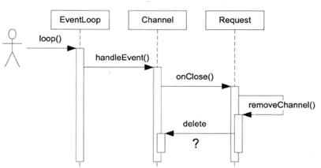

# Channel

## 什么是channel

Channel 对文件描述符和事件进行了一层封装。平常我们写网络编程相关函数，基本就是创建套接字，绑定地址，转变为可监听状态（这部分我们在 Socket 类中实现过了，交给 Acceptor 调用即可），然后接受连接。

但是得到了一个初始化好的 socket 还不够，我们是需要监听这个 socket 上的事件并且处理事件的。比如我们在 Reactor 模型中使用了 epoll 监听该 socket 上的事件，我们还需将需要被监视的套接字和监视的事件注册到 epoll 对象中。

可以想到文件描述符和事件和 IO 函数全都混在在了一起，极其不好维护。而 muduo 中的 Channel 类将文件描述符和其感兴趣的事件（需要监听的事件）封装到了一起。而事件监听相关的代码放到了 Poller/EPollPoller 类中。

## 要点总结

事件分发器 `event dispatcher`中最重要的两个类型 `channel` 和 `Poller`

`Channel`可理解为通道，`poller`往通道传输数据(**事件发生情况**)。

EventLoop包含**多个channel** 和**一个 Poller**；

Channel相当于是对**socket**的**事件处理**封装，包含了socket的详细信息，scoket以及感兴趣的事件都在channel里；

channel是muduo库负责**注册读写事件**的类，并保存了fd读写事件发生时调用的**回调函数**，如果poll/epoll有读写事件发生则将这些事件添加到对应的通道中。

+   一个`channel`对应唯一`EventLoop`，一个`EventLoop`可以有多个`channel`。
    
+   Channel类不负责fd的生存期，fd的生存期是由socket决定的，断开连接关闭描述符。
    
+   当有fd返回读写事件时，调用提前注册的回调函数处理读写事件
    
+   头文件中只给类的**前置声明**，而在源文件中再给出头文件包含，因为源文件会被编程动态库.so, 减少对外暴露
    
+   `weak_ptr` 用于观察绑定对象的状态，并且可以尝试提升为`shared_ptr`

Channel这个模块对应Reactor模型上的 **Event** 的抽象

## 成员变量

> "Channel.h"

```cpp
/**
* const int Channel::kNoneEvent = 0;
* const int Channel::kReadEvent = EPOLLIN | EPOLLPRI;
* const int Channel::kWriteEvent = EPOLLOUT;
*/
static const int kNoneEvent;
static const int kReadEvent;
static const int kWriteEvent;

EventLoop *loop_;   // 当前Channel属于的EventLoop
const int fd_;      // fd, Poller监听对象
int events_;        // 注册fd感兴趣的事件
int revents_;       // poller返回的具体发生的事件
int index_;         // 在Poller上注册的情况

std::weak_ptr<void> tie_;   // 弱指针指向TcpConnection(必要时升级为shared_ptr多一份引用计数，避免用户误删)，在removeChannel时使用
bool tied_;  // 标志此 Channel 是否被调用过 Channel::tie 方法

// 保存着事件到来时的回调函数
ReadEventCallback readCallback_; 	// 读事件回调函数
EventCallback writeCallback_;		// 写事件回调函数
EventCallback closeCallback_;		// 连接关闭回调函数
EventCallback errorCallback_;		// 错误发生回调函数
```

- `int fd_`：这个Channel对象照看的文件描述符
- `int events_`：代表fd感兴趣的事件类型集合
- `int revents_`：代表事件监听器实际监听到该fd发生的事件类型集合，当事件监听器监听到一个fd发生了什么事件，通过`Channel::set_revents()`函数来设置revents值。
- `EventLoop* loop_`：这个 Channel 属于哪个EventLoop对象，因为 muduo 采用的是 one loop per thread 模型，所以我们有不止一个 EventLoop。我们的 mainLoop 接收新连接，将新连接相关事件注册到线程池中的某一线程的 subLoop 上（轮询）。我们不希望跨线程的处理函数，所以每个 Channel 都需要记录是哪个 EventLoop 在处理自己的事情，这其中还涉及到了线程判断的问题。
- `read_callback_` 、`write_callback_`、`close_callback_`、`error_callback_`：这些是 std::function 类型，代表着这个Channel为这个文件描述符保存的各事件类型发生时的处理函数。比如这个fd发生了可读事件，需要执行可读事件处理函数，这时候Channel类都替你保管好了这些可调用函数。到时候交给 EventLoop 执行即可。
- `index`：我们使用 index 来记录 channel 与 Poller 相关的几种状态，Poller 类会判断当前 channel 的状态然后处理不同的事情。
  - `kNew`：是否还未被poll监视
  - `kAdded`：是否已在被监视中
  - `kDeleted`：是否已被移除
- `kNoneEvent`、`kReadEvent`、`kWriteEvent`：事件状态设置会使用的变量

## 成员函数

### 设置此 Channel 对于事件的回调函数

```cpp
// 设置回调函数对象
// 使用右值引用，延长了临时cb对象的生命周期，避免了拷贝操作
void setReadCallback(ReadEventCallback cb) { readCallback_ = std::move(cb); }
void setWriteCallback(ReadEventCallback cb) { readCallback_ = std::move(cb); }
void setCloseCallback(ReadEventCallback cb) { readCallback_ = std::move(cb); }
void setErrorCallback(ReadEventCallback cb) { readCallback_ = std::move(cb); }
```

### 设置 Channel 感兴趣的事件到 Poller

```cpp
// 设置fd相应的事件状态，update()其本质调用epoll_ctl
void enableReading() { events_ |= kReadEvent; update(); }     // 设置读事件到poll对象中
void disableReading() { events_ &= ~kReadEvent; update(); }   // 从poll对象中移除读事件
void enableWriting() { events_ |= kWriteEvent; update(); }    // 设置写事件到poll对象中
void disableWriting() { events_ &= ~kWriteEvent; update(); }  // 从poll对象中移除写事件
void disableAll() { events_ = kNoneEvent; update(); }         // 关闭所有事件
bool isWriting() const { return events_ & kWriteEvent; }      // 是否关注写事件
bool isReading() const { return events_ & kReadEvent; }       // 是否关注读事件
```

设置好该 Channel 的监视事件的类型，调用 update 私有函数向 Poller 注册。实际调用 epoll_ctl

```cpp
/**
 * 当改变channel所表示fd的events事件后
 * update负责在poller里面更改fd相应的事件epoll_ctl 
 */
void Channel::update()
{
    // 通过该channel所属的EventLoop，调用poller对应的方法，注册fd的events事件
    loop_->updateChannel(this);
}
```

### 更新Channel关注的事件

```cpp
// 更新该fd相关事件
void Channel::update()
{
  // 设置该channel状态为已加入EventLoop
  addedToLoop_ = true;
  // 调用EventLoop::updateChannel，传入channel指针
  // EventLoop::updateChannel => Poller::updateChannel
  loop_->updateChannel(this);
}
```


### 移除操作

```cpp
// 从epoll对象中移除该fd
void Channel::remove()
{
  // 断言无事件处理
  assert(isNoneEvent());  
  // 设置该Channel没有被添加到eventLoop
  addedToLoop_ = false;   
  // 调用EventLoop::removeChannel，传入channel指针
  // EventLoop::removeChannel => Poller::removeChannel
  loop_->removeChannel(this);
}
```


### 用于增加TcpConnection生命周期的tie方法（防止用户误删操作）

```cpp
// channel的tie方法什么时候调用过？
// 在TcpConnection建立得时候会调用
// 一个TcpConnection新连接创建的时候 TcpConnection => Channel
void Channel::tie(const std::shared_ptr<void> &obj)
{
    // weak_ptr 指向 obj
    tie_ = obj;
    // 设置tied_标志
    tied_ = true;
}
```

```cpp
// fd得到poller通知以后，去处理事件
void Channel::handleEvent(Timestamp receiveTime)
{
    /**
     * 调用了Channel::tie会设置tied_=true
     * 而TcpConnection::connectEstablished会调用channel_->tie(shared_from_this());
     * 所以对于TcpConnection::channel_ 需要多一份强引用的保证以免用户误删TcpConnection对象
     */
    if (tied_)
    {
        // 通过调用`lock()`函数生成一个有效的`std::shared_ptr`来使用这个对象
        // 可以确保对象在使用期间不会被提前销毁
        std::shared_ptr<void> guard = tie_.lock();
        if (guard)
        {
            // 资源存活
            handleEventWithGuard(receiveTime);
        }
        else 
        {
            handleEventWithGuard(receiveTime);
        }

    }
}

```

用户使用muduo库的时候，会利用到TcpConnection。用户可以看见 TcpConnection，如果用户注册了要监视的事件和处理的回调函数，并在处理 subLoop 处理过程中「误删」了 TcpConnection 的话会发生什么呢？

总之，EventLoop 肯定不能很顺畅的运行下去。毕竟它的生命周期小于 TcpConnection。为了防止用户误删的情况，TcpConnection 在创建之初 `TcpConnection::connectEstablished` 会调用此函数来提升对象生命周期。

实现方案是在处理事件时，如果对被调用了`tie()`方法的Channel对象，我们让一个共享型智能指针指向它，在处理事件期间延长它的生命周期。哪怕外面「误删」了此对象，也会因为多出来的引用计数而避免销毁操作。

```cpp
// 连接建立
void TcpConnection::connectEstablished()
{
    setState(kConnected); // 建立连接，设置一开始状态为连接态
    /**
     * channel_->tie(shared_from_this());
     * tie相当于在底层有一个强引用指针记录着，防止析构
     * 为了防止TcpConnection这个资源被误删掉，而这个时候还有许多事件要处理
     * channel->tie 会进行一次判断，是否将弱引用指针变成强引用，变成得话就防止了计数为0而被析构得可能
     */
    channel_->tie(shared_from_this());
    channel_->enableReading(); // 向poller注册channel的EPOLLIN读事件

    // 新连接建立 执行回调
    connectionCallback_(shared_from_this());
}
```

注意，传递的是 this 指针，所以是在 Channel 的内部增加对 TcpConnection 对象的引用计数（而不是 Channel 对象）。这里体现了 shared_ptr 的一处妙用，可以通过引用计数来控制变量的生命周期。巧妙地在内部增加一个引用计数，假设在外面误删，也不会因为引用计数为 0 而删除对象。

> `weak_ptr.lock()` 会返回 `shared_ptr`（如果 weak_ptr 不为空）。

#### Channel::tie()详解

这里是一个智能指针使用的特定场景之一，用于延长特定对象的生命期

结合例子分析，看下面的一个调用时序图



当对方断开TCP连接，这个IO事件会触发Channel::handleEvent()调用，后者会调用用户提供的CloseCallback，而用户代码在onClose()中有可能析构Channel对象，这就造成了灾难。等于说Channel::handleEvent()执行到一半的时候，其所属的Channel对象本身被销毁了。这时程序立刻core dump就是最好的结果了。

Muduo的解决办法是提供`Channel::tie(const boost::shared_ptr<void>&)`这个函数，用于延长某些对象（可以是Channel对象，也可以是其owner对象）的生命期，使之长过Channel::handleEvent()函数。

Muduo TcpConnection采用shared_ptr管理对象生命期的原因之一就是因为这个。

当有关闭事件时，调用流程如下：

```
Channel::handleEvent -> TcpConnection::handleClose ->TcpClient::removeConnection ->TcpConnection::connectDestroyed->channel_->remove()。
```

1、为了在Channel::handleEvent处理期间，防止因其owner对象被修改，进而导致Channel被析构，最后出现不可预估错误。 Channel::tie()的作用就是将Channel的owner对象进行绑定保护起来。

 2、另外channel->remove的作用是删除channel在Poll中的地址拷贝，而不是销毁channel。channel的销毁由其owner对象决定。


### 根据相应事件执行Channel保存的回调函数

我们的Channel里面保存了许多回调函数，这些都是在对应的事件下被调用的。用户提前设置写好此事件的回调函数，并绑定到Channel的成员里。等到事件发生时，Channel自然的调用事件处理方法。借由回调操作实现了异步的操作。

```cpp
void Channel::handleEventWithGuard(Timestamp receiveTime)
{
    // 标志，此时正在处理各个事件
    eventHandling_ = true;
    LOG_TRACE << reventsToString();
    // 对端关闭事件
    if ((revents_ & POLLHUP) && !(revents_ & POLLIN))
    {
        if (logHup_)
        {
            LOG_WARN << "fd = " << fd_ << " Channel::handle_event() POLLHUP";
        }
        // 内部储存function，这是判断是否注册了处理函数，有则直接调用
        if (closeCallback_) closeCallback_();
    }
    // fd不是一个打开的文件
    if (revents_ & POLLNVAL)
    {
        LOG_WARN << "fd = " << fd_ << " Channel::handle_event() POLLNVAL";
    }
    // 发生了错误，且fd不是一个可以打开的文件
    if (revents_ & (POLLERR | POLLNVAL))
    {
        if (errorCallback_) errorCallback_();
    }
    // 读事件 且是高优先级读且发生了挂起
    if (revents_ & (POLLIN | POLLPRI | POLLRDHUP))
    {
        if (readCallback_) readCallback_(receiveTime);
    }
    // 写事件
    if (revents_ & POLLOUT)
    {
        if (writeCallback_) writeCallback_();
    }
    eventHandling_ = false;
}
```


## 完整代码（可跳过）

> "Channel.h"

```cpp

#pragma once

#include "Timestamp.h"
#include "noncopyable.h"

#include <functional>
#include <memory>

namespace mymuduo
{

// 类型的前置声明，不要暴露太多头文件中的内容
// EventLoop包含了Poller和Channel
// Channel里包含了fd，events，revents

// 这些事件最终向poller里注册，发生的事件由poller向channel进行通知
// channel得到相应fd的事件通知以后，最终调用相应的回调函数
class EventLoop;
class Timestamp;

/**
 * 理清楚  EventLoop、Channel、Poller之间的关系 《= 在Reactor模型上对应 Demultiplex
 * Channel 理解为通道，封装了sockfd和其感兴趣的event，如EPOLLIN、EPOLLOUT事件
 * 还绑定了poller返回的具体事件
 */ 

class Channel : noncopyable {
public:
    // 回调
    using EventCallback = std::function<void()>;
    using ReadEventCallback = std::function<void(Timestamp)>;

    Channel(EventLoop* looP, int fd);
    ~Channel();

    // fd得到poller通知以后，处理事件的。就是调用相应的回调方法
    void handleEvent(Timestamp receiveTime);

    // 设置回调函数对象
    // std::move把一个左值转换成右值
    void setReadCallback(ReadEventCallback cb) {
        readCallback_ = std::move(cb);
    }
    void setWriteCallback(EventCallback cb) { writeCallback_ = std::move(cb); }
    void setCloseCallback(EventCallback cb) { closeCallback_ = std::move(cb); }
    void setErrorCallback(EventCallback cb) { errorCallback_ = std::move(cb); }

    // 防止当channel被手动remove掉，channel还在执行回调操作
    // 智能指针
    void tie(const std::shared_ptr<void>&);

    int fd() const { return fd_; }
    int events() const { return events_; }
    // 设置具体发生的事件
    void set_revents(int revt) { revents_ = revt; }

    // 设置fd相应的事件状态
    // 相应的readevent置位
    void enableReading() {
        events_ |= kReadEvent;
        update();
    }
    // 取反后与，相当于取消置位
    void disableReading() {
        events_ &= ~kReadEvent;
        update();
    }
    void enableWriting() {
        events_ |= kWriteEvent;
        update();
    }
    void disableWriting() {
        events_ &= ~kWriteEvent;
        update();
    }
    // 所有事件都取消置位
    void disableAll() {
        events_ = kNoneEvent;
        update();
    }

    // 返回fd当前的事件状态
    bool isNoneEvent() const { return events_ == kNoneEvent; }
    // 相与后还为1，说明确实有这个事件
    bool isWriting() const { return events_ & kWriteEvent; }
    bool isReading() const { return events_ & kReadEvent; }

    int index() { return index_; }
    void set_index(int idx) { index_ = idx; }

    // one loop per thread
    EventLoop* ownerLoop() {return loop_;}
    void remove();

private:
    void update();
    // 用于处理事件，并提供异常保护
    void handleEventWithGuard(Timestamp receiveTime);

    static const int kNoneEvent; // 无事件
    static const int kReadEvent;
    static const int kWriteEvent;

    EventLoop* loop_;  // 事件循环
    const int fd_;     // fd, Poller监听的对象  epoll_ctrl
    int events_;       // 注册fd感兴趣的事件
    int revents_;      // poller返回的具体发生的事件
    int index_; 

    bool eventHandling_; //标志着是否正在处理事件，防止析构一个正在处理事件的Channel
    bool addedToLoop_;  // 标志着Channel是否在Loop的ChannelLists，也即是否被添加

    std::weak_ptr<void> tie_; // removeChannel时使用
    bool tied_; 

    // 因为channel通道里面能够获知fd最终发生的具体的事件revents，所以它负责调用具体事件的回调操作
    ReadEventCallback readCallback_;
    EventCallback writeCallback_;
    EventCallback closeCallback_;
    EventCallback errorCallback_;
};

}
```

> "Channel.cc"

```cpp

#include "Channel.h"

#include <sys/epoll.h>
#include <cassert>
#include "EventLoop.h"
#include "Logger.h"

namespace mymuduo
{

// 类静态成员需要在类外初始化
const int Channel::kNoneEvent = 0;
// EPOLLPRI紧急数据到达
const int Channel::kReadEvent = EPOLLIN | EPOLLPRI;
const int Channel::kWriteEvent = EPOLLOUT;

// EventLoop: ChannelList Poller
Channel::Channel(EventLoop* loop, int fd)
    : loop_(loop),
      fd_(fd),
      events_(0),
      revents_(0),
      index_(-1),
      tied_(false),
      eventHandling_(false),
      addedToLoop_(false) {}

Channel::~Channel() {
    // 在原库里做了断言，我们这里可以什么都不做
    assert(!eventHandling_);
    assert(!addedToLoop_);
    if (loop_->isInLoopThread()) {
        // eventloop释放的必须是自己的channel
        assert(!loop_->hasChannel(this));
    }
}

// 强弱、智能指针的应用需要学
// 一个TcpConnection新连接创建的时候 TcpConnection => Channel
// channel的tie方法什么时候调用过？
// 有一个强智能指针记着，资源就不会被释放
void Channel::tie(const std::shared_ptr<void>& obj) {
    // weak_ptr解决shared_ptr循环引用
    tie_ = obj;
    tied_ = true;
}

/**
 * 当改变channel所表示fd的events事件后，update负责在poller里面更改fd相应的事件epoll_ctl
 * channel需要通过eventloop才能控制poller
 * EventLoop => ChannelList Poller（这里表示ChannelList、Poller在EventLoop里面） 
 */
void Channel::update() {
    addedToLoop_ = true;
    // 通过channel所属的eventloop，调用poller的相应方法，注册fd的events事件
    loop_->updateChannel(this);
}

// 在channel中所属的eventloop中，把当前的channel删除掉
void Channel::remove() {
    assert(isNoneEvent());
    addedToLoop_ = false;
    loop_->removeChannel(this);
}

// fd得到poller通知以后，处理事件的
void Channel::handleEvent(Timestamp receiveTime) {
    // 如果有将一个shared_ptr转换为weak_ptr
    if (tied_) {
        // 通过调用`lock()`函数生成一个有效的`std::shared_ptr`来使用这个对象
        // 可以确保对象在使用期间不会被提前销毁
        std::shared_ptr<void> guard = tie_.lock();
        if (guard) {
            // 资源存活
            handleEventWithGuard(receiveTime);
        }
    } else {
        handleEventWithGuard(receiveTime);
    }
}

// 根据poller通知的channel发生的具体事件，由channel负责调用具体的回调操作
void Channel::handleEventWithGuard(Timestamp receiveTime) {
    // __FUNCTION__   __LINE__ 内带的宏，打印函数、行号
    // 打印日志信息
    LOG_INFO("channel handleEvent revents:%d\n", revents_);
    eventHandling_ = true;
    // EPOLLHUP：挂起或者关闭，也就是读写都关闭
    if ((revents_ & EPOLLHUP) && !(revents_ & EPOLLIN)) {
        // 发生异常了
        if (closeCallback_) {
            closeCallback_();
        }
    }

    if (revents_ & EPOLLERR) {
        if (errorCallback_) {
            errorCallback_();
        }
    }

    if (revents_ & (EPOLLIN | EPOLLPRI)) {
        if (readCallback_) {
            readCallback_(receiveTime);
        }
    }

    if (revents_ & EPOLLOUT) {
        if (writeCallback_) {
            writeCallback_();
        }
    }
    eventHandling_ = false;
}

}
```
