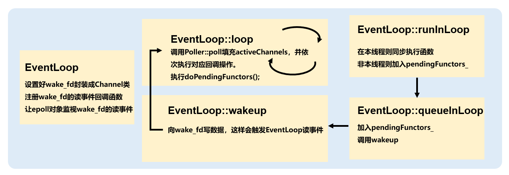
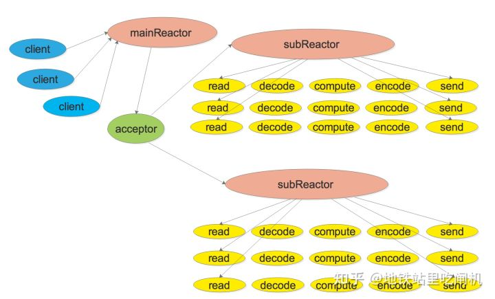
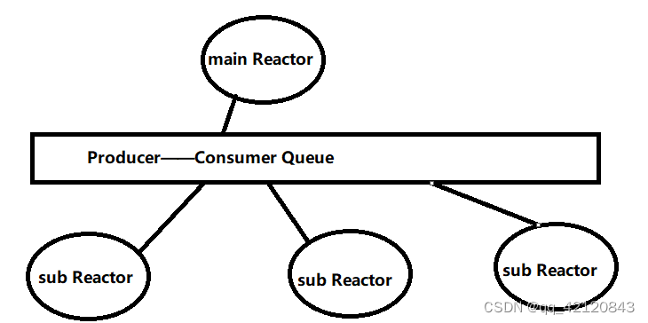

# EventLoop

## 要点

`EventLoop` 是Reactor的核心组件了，该类本质上不做任何工作，只是负责使用和协调`Channel` 类对象和 `Poller`类对象的工作。其管理最重要的两个成员

`one loop per thread`顾名思义每个线程只能有一个EventLoop对象，因此EventLoop的构造函数会检查当前线程是否已经创建了其他EventLoop对象，遇到错误就终止程序（LOG\_FATAL)。EventLoop的构造函数会记住**本对象所属的线程**（`threadId_`）。创建了EventLoop对象的线程是**IO线程**，其主要功能是运行事件循环`EventLoop:: loop()`。EventLoop对象的生命期通常和其所属的线程一样长，它不必是`heap`对象。

事件循环必须在IO线程执行，因此`EventLoop::loop()`会检查这一precondition，防止其他线程来执行当前 EventLoop 对象的 loop(),比如下面的情况：

```cpp
muduo::EventLoop *g_loop;
void threadFunc()
{
	g_loop->loop();
}
int main()
{
	muduo::EventLoop loop;
    g_loop = &loop;
    muduo::Thread t(threadFunc);
    t.start();
    t.join();
}
```

它在主线程创建了EventLoop对象，却试图在另一个线程调用其`EventLoop::loop()`，程序会因断言失效而异常终止

### eventfd()

```cpp
#include <sys/eventfd.h>
int eventfd(unsigned int initval, int flags);
```

`eventfd()`函数创建一个"eventfd对象"，可以被用户空间应用程序用作**事件等待/通知机制**，同时也可以被**内核用于通知用户空间应用程序事件的发生**。该对象包含一个无符号64位整数（uint64\_t）计数器，由内核维护。该计数器初始化为参数initval指定的值。

该函数优点是

1. **高效**：与其他进程间通信机制相比，如管道、消息队列等，eventfd() 的开销更小，因为它不需要**内核和用户空间之间的数据复制**。这使得它在高性能应用中更具优势。
2. **可移植**性：eventfd() 是 POSIX 标准的一部分，因此在各种 UNIX 系统中都可用。
3. 支持**异步事件通知**：eventfd() 允许应用程序使用 epoll 或 select 等机制监视文件描述符，以便在文件描述符可读时通知应用程序。这使得它适用于实现高性能事件驱动的应用程序。
4. 支持**线程间通信**：eventfd() 可以用于在不同线程之间传递信号，使得它在多线程应用程序中非常有用。

每个`EventLoop` 使用 `eventfd()`创建一个 `wakeupFd` 用于其他`eventloop` 来唤醒相应的自己 Eventloop，所谓唤醒，也就是给这个 `wakeupFd` 发送一个小数据，使对应Eventloop上的 `epoll_wait`检测到 wakeupFd 读事件，便解除阻塞。

## EventLoop的作用

EventLoop 可以算是 muduo 的核心类了，EventLoop 对应着事件循环，其驱动着 Reactor 模型。我们之前的 Channel 和 Poller 类都需要依靠 EventLoop 类来调用。

1. Channel 负责封装文件描述符和其感兴趣的事件，里面还保存了事件发生时的回调函数
2. Poller 负责`I/O`复用的抽象，其内部调用`epoll_wait`获取活跃的 Channel
3. EventLoop 相当于 Channel 和 Poller 之间的桥梁，Channel 和 Poller 之间并不之间沟通，而是借助着 EventLoop 这个类。

这里上代码，我们可以看见 EventLoop 的成员变量就有 Channel 和 Poller。

> EventLoop.hh

```cpp
std::unique_ptr<Poller> poller_;

// scratch variables
ChannelList activeChannels_;
Channel* currentActiveChannel_;
```
其实 EventLoop 也就是 `Reactor`模型的一个实例，其重点在于循环调用 `epoll_wait` 不断的监听发生的事件，然后调用处理这些对应事件的函数。而这里就设计了线程之间的通信机制了。

最初写`socket`编程的时候会涉及这一块，调用`epoll_wait`不断获取发生事件的文件描述符，这其实就是一个事件循环。

> EventLoop.cc

```cpp
while (1)
{
    // 返回发生的事件个数
    int n = epoll_wait(epfd, ep_events, EPOLL_SIZE, -1); 

    // 这个循环的所有文件描述符都是发生了事件的，效率得到了提高
    for (i = 0; i < n; i++)
    {
        //客户端请求连接时
        if (ep_events[i].data.fd == serv_sock) 
        {
        	// 接收新连接的到来
        }
        else //是客户端套接字时
        {
        	// 负责读写数据
        }
    }
}
```

## EventLoop重要成员变量

> EventLoop.h

```cpp
using ChannelList = std::vector<Channel*>;

std::atomic_bool looping_;  // 原子操作，通过CAS实现，标志正在执行事件循环
std::atomic_bool quit_;     // 标志退出事件循环
std::atomic_bool callingPendingFunctors_; // 标志当前loop是否有需要执行的回调操作
const pid_t threadId_;      // 记录当前loop所在线程的id
Timestamp pollReturnTime_;  // poller返回发生事件的channels的返回时间
std::unique_ptr<Poller> poller_;

/**
 * TODO:eventfd用于线程通知机制，libevent和我的webserver是使用sockepair
 * 作用：当mainLoop获取一个新用户的Channel 需通过轮询算法选择一个subLoop 
 * 通过该成员唤醒subLoop处理Channel
 */
int wakeupFd_;  // mainLoop向subLoop::wakeupFd写数据唤醒
std::unique_ptr<Channel> wakeupChannel_;

ChannelList activeChannels_;            // 活跃的Channel，poll函数会填满这个容器
Channel* currentActiveChannel_;         // 当前处理的活跃channel
std::mutex mutex_;                      // 用于保护pendingFunctors_线程安全操作
std::vector<Functor> pendingFunctors_;  // 存储loop跨线程需要执行的所有回调操作
```

1. `wakeupFd_`：如果需要唤醒某个`EventLoop`执行异步操作，就向其`wakeupFd_`写入数据。
2. `activeChannels_`：调用`poller_->poll`时会得到发生了事件的`Channel`，会将其储存到`activeChannels_`中。
3. `pendingFunctors_`：如果涉及跨线程调用函数时，会将函数储存到`pendingFunctors_`这个任务队列中。


## EventLoop重要方法
### 判断是否跨线程调用 isInLoopThread()


muduo 是主从`Reactor`模型，主`Reactor`负责监听连接，然后通过轮询方法将新连接分派到某个从`Reactor`上进行维护。

1. 每个线程中只有一个`Reactor`
2. 每个`Reactor`中都只有一个`EventLoop`
3. 每个`EventLoop`被创建时都会保存创建它的线程值。

> EventLoop.h

```cpp
bool isInLoopThread() const { return threadId_ == CurrentThread::tid(); }
```
> CurrentThread.cc

```cpp
// 以下是 CurrentThread::tid 的实现
namespace CurrentThread
{
    extern __thread int t_cachedTid; // 保存tid缓冲，避免多次系统调用
    
    void cacheTid();

    // 内联函数
    inline int tid()
    {
        if (__builtin_expect(t_cachedTid == 0, 0))
        {
            cacheTid();
        }
        return t_cachedTid;
    }
}
```
### EventLoop 创建之初都做了什么？

> EventLoop.cc

```cpp
EventLoop::EventLoop()
  : looping_(false), // 还未开启任务循环，设置为false
    quit_(false),   // 还未停止事件循环
    eventHandling_(false), // 还未开始处理任务
    callingPendingFunctors_(false),
    iteration_(0),
    threadId_(CurrentThread::tid()), // 获取当前线程tid
    poller_(Poller::newDefaultPoller(this)), // 获取默认的poller
    timerQueue_(new TimerQueue(this)), // 定时器管理对象
    wakeupFd_(createEventfd()), // 创建eventfd作为线程间等待/通知机制
    wakeupChannel_(new Channel(this, wakeupFd_)), // 封装wakeupFd成Channel
    currentActiveChannel_(NULL) // 当前正执行的活跃Channel
{
    LOG_DEBUG << "EventLoop created " << this << " in thread " << threadId_;
    // 已经保存了thread值，之前已经创建过了EventLoop
    // 一个线程只能对应一个EventLoop，直接退出
    if (t_loopInThisThread)
    {
        LOG_FATAL << "Another EventLoop " << t_loopInThisThread
                    << " exists in this thread " << threadId_;
    }
    else
    {
        // 线程静态变量保存tid值
        t_loopInThisThread = this;
    }
    // 设置wakeupChannel_的读事件回调函数
    wakeupChannel_->setReadCallback(
        std::bind(&EventLoop::handleRead, this));
    // we are always reading the wakeupfd
    // 将wakeupChannel_注册到epoll，关注读事件
    // 如果有别的线程唤醒当前EventLoop，就会向wakeupFd_写数据，触发读操作
    wakeupChannel_->enableReading();
}
```
这里关注一下`eventfd`的创建，创建时指定其为非阻塞
```cpp
int createEventfd()
{
    int evfd = ::eventfd(0, EFD_NONBLOCK | EFD_CLOEXEC);
    if (evfd < 0)
    {
        LOG_FATAL("eventfd error:%d \n", errno);
    }
    return evfd;
}
```
### EventLoop 销毁时的操作

> EventLoop.h

```cpp
EventLoop::~EventLoop()
{
    // channel移除所有感兴趣事件
    wakeupChannel_->disableAll();
    // 将channel从EventLoop中删除
    wakeupChannel_->remove();
    // 关闭 wakeupFd_
    ::close(wakeupFd_);
    // 指向EventLoop指针为空
    t_loopInThisThread = nullptr;
}
```

1. 移除`wakeupChannel`要监视的所有事件
2. 将`wakeupChannel`从`Poller`上移除
3. 关闭`wakeupFd`
4. 将EventLoop指针置为空
### EventLoop 事件驱动的核心——loop()
调用 EventLoop.loop() 正式开启事件循环，其内部会调用 `Poller::poll -> ::epoll_wait`正式等待活跃的事件发生，然后处理这些事件。

1. 调用 `poller_->poll(kPollTimeMs, &activeChannels_)` 将活跃的 Channel 填充到 activeChannels 容器中。
2. 遍历 activeChannels 调用各个事件的回调函数
3. 调用 `doPengdingFunctiors()`处理跨线程调用的回调函数
> EventLoop.cc

```cpp
void EventLoop::loop()
{
    looping_ = true;
    quit_ = false;

    LOG_INFO("EventLoop %p start looping \n", this);

    while (!quit_)
    {
        // 清空activeChannels_
        activeChannels_.clear();
        // 获取
        pollReturnTime_ = poller_->poll(kPollTimeMs, &activeChannels_);
        for (Channel *channel : activeChannels_)
        {
            channel->handleEvent(pollReturnTime_);
        }
        // 执行当前EventLoop事件循环需要处理的回调操作
        /**
         * IO thread：mainLoop accept fd 打包成 chennel 分发给 subLoop
         * mainLoop实现注册一个回调，交给subLoop来执行，wakeup subLoop 之后，让其执行注册的回调操作
         * 这些回调函数在 std::vector<Functor> pendingFunctors_; 之中
         */
        doPendingFunctors();
    }
    LOG_INFO("EventLoop %p stop looping.\n", this);
    looping_ = false;    
}
```
### EventLoop 如何执行分派任务
EventLoop 使用 `runInLoop(Functor cb)`函数执行任务，传入参数是一个回调函数，让此 EventLoop 去执行任务，可跨线程调用。比如可以这么调用：
```cpp
ioLoop->runInLoop(std::bind(&TcpConnection::connectEstablished, conn));
```
这是 `TcpServer`类的一处代码，其在接收了一个新连接后会创建一个对应的`TcpConnection`对象来负责连接。而`TcpConnection`是需要执行一些初始化操作的，这里就是让EventLoop执行`TcpConnection`的初始化任务。

我们继续看一下 `EventLoop::runInLoop` 的内部

> EventLoop.cc

```cpp
// 在I/O线程中调用某个函数，该函数可以跨线程调用
void EventLoop::runInLoop(Functor cb)
{
    if (isInLoopThread())
    {
        // 如果是在当前I/O线程中调用，就同步调用cb回调函数
        cb();
    }
    else
    {
        // 否则在其他线程中调用，就异步将cb添加到任务队列当中，
        // 以便让EventLoop真实对应的I/O线程执行这个回调函数
        queueInLoop(std::move(cb));
    }
}
```
`isInLoopThread`判断本线程是不是创建该 EventLoop 的线程

1. 如果是创建该 EventLoop 的线程，则直接同步调用，执行任务
2. 如果不是，则说明这是跨线程调用。需要执行`queueInLoop`
### EventLoop 是如何保证线程安全的
还以上述的那个例子：
```cpp
EventLoop* ioLoop = threadPool_->getNextLoop();
ioLoop->runInLoop(std::bind(&TcpConnection::connectEstablished, conn));
```
这里获取的 ioLoop 是从线程池中某个线程创建而来的，那么可以知道创建 ioLoop 的线程和目前运行的线程不是同一个线程，那么这个操作是线程不安全的。

一般为了保证线程安全，我们可能会使用互斥锁之类的手段来保证线程同步。但是，互斥锁的粗粒度难以把握，如果锁的范围很大，各个线程频繁争抢锁执行任务会大大拖慢网络效率。

而 muduo 的处理方法是，保证各个任务在其原有的线程中执行。如果跨线程执行，则将此任务加入到任务队列中，并唤醒应当执行此任务的线程。而原线程唤醒其他线程之后，就可以继续执行别的操作了。可以看到，这是一个异步的操作。
接下来继续探索`queueInLoop`的实现：

> EventLoop.cc

```cpp
// 将任务添加到队列当中，队就是成员pendingFunctors_数组容器
void EventLoop::queueInLoop(Functor cb)
{
    {
        // 操作任务队列需要保证互斥
        MutexLockGuard lock(mutex_);
        pendingFunctors_.push_back(std::move(cb));
    }

    /**
     * 调用此函数的线程不是这个EventLoop的创建线程
     * 或者正在处理PendingFunctors的情况则唤醒IO线程
     * 
     * 如果是当前的IO线程调用且并没有正处理PendgingFunctors
     * 则不必唤醒
     * ||callingPendingFunctors_的意思是：当前loop正在执行回调，但是loop又有了新的回调，继续唤醒执行新的回调
     */    
    if (!isInLoopThread() || callingPendingFunctors_)
    {
        wakeup();
    }
}
```
`queueInLoop`的实现也有很多细节，首先可以看到在局部区域生成一个互斥锁（支持`RALL`），然后再进行任务队列加入新任务的操作。
这是因为可能此`EventLoop`会被多个线程所操纵，假设多个线程调用`loop->queueInLoop(cb)`，都向此任务队列加入自己的回调函数，这势必会有线程间的竞争情况。需要在此处用一个互斥锁保证互斥，可以看到这个锁的粒度比较小。

再往下，注意下方这个判断，`if (!isInLoopThread() || callingPendingFunctors_)`，第一个很好理解，不在本线程则唤醒这个 `EventLoop `所在的线程。第二个标志位的判断是什么意思呢？

`callingPendingFunctors_` 这个标志位在 `EventLoop::doPendingFunctors()` 函数中被标记为 true。 **也就是说如果 EventLoop 正在处理当前的 PendingFunctors 函数时有新的回调函数加入，我们也要继续唤醒。** 倘若不唤醒，那么新加入的函数就不会得到处理，会因为下一轮的 epoll_wait 而继续阻塞住，这显然会降低效率。这也是一个 muduo 的细节。
继续探索 `wakeup()` 函数，从其名字就很容易看出来，这是唤醒其他线程的操作。如何唤醒那个`EventLoop`的所在线程呢，其实只要往其 `wakeupFd_ `写数据就行。

每个`EventLoop`的`wakeupFd_`都被加入到`epoll`对象中，只要写了数据就会触发读事件，`epoll_wait `就会返回。因此`EventLoop::loop`中阻塞的情况被打断，`Reactor`又被事件「驱动」了起来。

> EventLoop.cc

```cpp
void EventLoop::wakeup()
{
    // 可以看到写的数据很少，纯粹是为了通知有事件产生
    uint64_t one = 1;
    ssize_t n = sockets::write(wakeupFd_, &one, sizeof one);
    if (n != sizeof one)
    {
        LOG_ERROR << "EventLoop::wakeup() writes " << n << " bytes instead of 8";
    }
}
```
这里可以看另一个例子，`TcpServer`的销毁连接操作。会在`baseLoop`中获取需要销毁的连接所在的`ioLoop/`，然后让`ioLoop`执行销毁操作，细节可以看注释。
```cpp
void TcpServer::removeConnectionInLoop(const TcpConnectionPtr& conn)
{
  loop_->assertInLoopThread();
  LOG_INFO << "TcpServer::removeConnectionInLoop [" << name_
           << "] - connection " << conn->name();
  // 从map删除
  size_t n = connections_.erase(conn->name());
  (void)n;
  assert(n == 1);
  // 获取subLoop
  EventLoop* ioLoop = conn->getLoop();
  /**
   * subLoop调用TcpConnection::connectDestroyed
   * 因为是在baseLoop的线程里调用subLoop的函数，所以不能同步调用，需要放入队列
   * 在加锁的环境下将此回调哈函数保存到subLoop的pendingFunctors_中并唤醒
   * 那么这个唤醒就是在baseLoop的线程里调用subLoop::wakeup写数据给subLoop的wakeFd,subLoop的主事件循环被唤醒执行pendingFunctors_
   * 而baseLoop线程在wakeup写完数据之后就没有继续往下执行了，这就保证整个函数只被subloop线程执行
   * 保证了线程的安全
   */
  ioLoop->queueInLoop(
      std::bind(&TcpConnection::connectDestroyed, conn));
}
```
### EventLoop 是如何处理 pendingFunctors 里储存的函数的？
这里又是一处细节。我们为什么不直接遍历这个容器，而是又不嫌麻烦地定义了一个 functors 交换我们 pendingFunctors 的元素，然后遍历 functors？

我们如果直接遍历 pendingFunctors，然后在这个过程中别的线程又向这个容器添加新的要被调用的函数，那么这个过程是线程不安全的。如果使用互斥锁，那么在执行回调任务的过程中，都无法添加新的回调函数。这是十分影响效率的。

所以我们选择拷贝这个时候的回调函数，这样只需要用互斥锁保护一个交换的操作。锁的粗粒度小了很多。我们执行回调操作就直接遍历这个`functors`容器，而其他线程继续添加回调任务到 `pendingFunctors`。

```cpp
void EventLoop::doPendingFunctors()
{
    std::vector<Functor> functors;
    callingPendingFunctors_ = true;

    /**
     * 如果没有生成这个局部的 functors
     * 则需要一个粗粒度较大的互斥锁加，我们直接遍历pendingFunctors
     * 那么其他线程这个时候无法访问，无法向里面注册回调函数，增加服务器时延
     */
    {
        std::unique_lock<std::mutex> lock(mutex_);
        functors.swap(pendingFunctors_);
    }

    for (const Functor &functor : functors)
    {
        functor();
    }
	// 记录此时结束了处理回调函数
    callingPendingFunctors_ = false;
}
```
### 主动关闭事件循环时会发生什么？
```cpp
void EventLoop::quit()
{
    quit_ = true;

    /**
     * TODO:生产者消费者队列派发方式和muduo的派发方式
     * 有可能是别的线程调用quit(调用线程不是生成EventLoop对象的那个线程)
     * 比如在工作线程(subLoop)中调用了IO线程(mainLoop)
     * 这种情况会唤醒主线程
     */
    if (isInLoopThread())
    {
        wakeup();
    }
}
```

1. `quit_`置为 true
2. 判断是否是当前线程调用，若不是则唤醒 `EventLoop`去处理事件。

第二点可以深究一下，通过 `while(!quit_)` （在EventLoop::loop()里）可以判断，唤醒之后会继续处理一轮事件，然后再进入判断语句，然后因为 `quit_ = true` 而退出循环。

所以如果可以调用成功，说明之前的任务都处理完了，不会出现正在处理任务的时候突然退出了。但是不能保证未来事件发生的处理。


## 完整代码

> EventLoop.h

```cpp

#pragma once

#include <atomic>
#include <functional>
#include <any>
#include <memory>
#include <mutex>
#include <vector>

#include "CurrentThread.h"
#include "Timestamp.h"
#include "noncopyable.h"

namespace mymuduo
{

class Channel;
class Poller;

// 时间循环类  主要包含了两个大模块 Channel   Poller（epoll的抽象）
class EventLoop : noncopyable {
public:
    using Functor = std::function<void()>;

    EventLoop();
    ~EventLoop();

    // 开启事件循环
    void loop();
    // 退出事件循环
    void quit();

    Timestamp pollReturnTime() const { return pollReturnTime_; }

    // 在当前loop中执行cb
    void runInLoop(Functor cb);
    // 把cb放入队列中，唤醒loop所在的线程，执行cb
    void queueInLoop(Functor cb);

    // 用来唤醒loop所在的线程的
    void wakeup();

    // EventLoop的方法 =》 Poller的方法
    void updateChannel(Channel* channel);
    void removeChannel(Channel* channel);
    bool hasChannel(Channel* channel);

    // 判断EventLoop对象是否在自己的线程里面
    bool isInLoopThread() const { return threadId_ == CurrentThread::tid(); }

    bool eventHandling() const { return eventHandling_; }

    void setContext(const std::any& context)
    { context_ = context; }

    const std::any& getContext() const
    { return context_; }

    std::any* getMutableContext()
    { return &context_; }


private:
    void handleRead();  // wake up  通过给wakeupfd上写入数据，唤醒ioLoop
    void doPendingFunctors();  // 执行回调

    using ChannelList = std::vector<Channel*>;

    std::atomic_bool looping_;  // 原子操作，通过CAS是实现的
    std::atomic_bool quit_;     // 标识退出loop循环
    std::atomic_bool eventHandling_;    // 表示是否在处理事件

    // 调用某个loop对象的线程未必是进行loop操作的线程
    // 记录当前EventLoop进行loop操作所在线程的tid，确保Channel回调在其对应的evnetloop中执行 
    const pid_t threadId_; 

    Timestamp pollReturnTime_;  // poller返回发生事件的channels的时间点
    std::unique_ptr<Poller> poller_;

    // 用了eventfd
    int wakeupFd_;  // 主要作用，当mainLoop获取一个新用户的channel，通过轮询算法选择一个subloop，通过该成员唤醒subloop处理channel
    // 别的线程唤醒本loop线程使用的Channel
    std::unique_ptr<Channel> wakeupChannel_;

    std::any context_;

    ChannelList activeChannels_;
    Channel* currentActiveChannel_;

    std::atomic_bool
        callingPendingFunctors_;  // 标识当前loop是否有需要执行的回调操作
    std::vector<Functor> pendingFunctors_;  // 存储loop需要执行的所有的回调操作
    std::mutex mutex_;  // 互斥锁，用来保护上面vector容器的线程安全操作（保护 pendingFunctors_ 线程安全操作）
};


}
```

> EventLoop.cc

```cpp
#include "EventLoop.h"
#include "Channel.h"
#include "Logger.h"
#include "Poller.h"

#include <errno.h>
#include <fcntl.h>
#include <sys/eventfd.h>
#include <unistd.h>
#include <cassert>
#include <memory>

namespace mymuduo {

// 防止一个线程创建多个EventLoop
// __thread: thread_local一个线程只能有一个EventLoop
__thread EventLoop* t_loopInThisThread = 0;

// 定义默认的Poller IO复用接口的超时时间
const int kPollTimeMs = 10000;

// 创建wakeupfd，用来notify唤醒subReactor处理新来的channel
int createEventfd() {
    // EFD_CLOEXEC处理fork()导致的fd泄漏
    // eventfd 用来创建用于事件 wait / signal 的fd
    // eventfd创建失败，一般不会失败，除非一个进程把文件描述符（Linux一个进程1024个最多）全用光了。
    int evtfd = ::eventfd(0, EFD_NONBLOCK | EFD_CLOEXEC);
    if (evtfd < 0) {
        LOG_FATAL("eventfd error:%d \n", errno);
    }
    return evtfd;
}

// wakeupFd_(createEventfd())：生成一个eventfd，每个EventLoop对象，都会有自己的eventfd
// threadId_(CurrentThread::tid())：当前lop的线程是构造时的线程
EventLoop::EventLoop()
    : looping_(false),
      quit_(false),
      eventHandling_(false),
      callingPendingFunctors_(false),
      threadId_(CurrentThread::tid()),
      poller_(Poller::newDefaultPoller(this)),
      wakeupFd_(createEventfd()),
      wakeupChannel_(new Channel(this, wakeupFd_)),
      currentActiveChannel_(nullptr) {
    LOG_DEBUG("EventLoop created %p in thread %d \n", this, threadId_);
    // 如果当前线程已经绑定了某个EventLoop对象了，那么该线程就无法创建新的EventLoop对象了
    if (t_loopInThisThread) {
        LOG_FATAL("Another EventLoop %p exists in this thread %d \n",
                  t_loopInThisThread, threadId_);
    } else {
        t_loopInThisThread = this;
    }

    // 设置wakeupfd的事件类型以及发生事件后的回调操作
    wakeupChannel_->setReadCallback(std::bind(&EventLoop::handleRead, this));
    // 每一个eventloop都将监听wakeupchannel_的EPOLLIN读事件了
    // 等待被唤醒
    wakeupChannel_->enableReading();
}

EventLoop::~EventLoop() {
    wakeupChannel_->disableAll(); // 对所有事件都不敢兴趣
    wakeupChannel_->remove();
    ::close(wakeupFd_);
    t_loopInThisThread = nullptr;
}

// 开启事件循环
void EventLoop::loop() {
    assert(!looping_);
    looping_ = true;
    quit_ = false;

    LOG_INFO("EventLoop %p start looping \n", this);

    while (!quit_) {
        activeChannels_.clear();
        // 监听两类fd，一种是client的fd，一种wakeupfd(mainReactor和subReactor通信用)
        // 此时activeChannels_已经填好了事件发生的channel
        pollReturnTime_ = poller_->poll(kPollTimeMs, &activeChannels_);
        eventHandling_ = true;
        for (Channel* channel : activeChannels_) {
            currentActiveChannel_ = channel;
            // Poller监听哪些channel发生事件了，然后上报给EventLoop，通知channel处理相应的事件
            currentActiveChannel_->handleEvent(pollReturnTime_);
        }
        currentActiveChannel_ = nullptr;
        eventHandling_ = false;
        // 执行当前EventLoop事件循环需要处理的回调操作
        /**
         * mainloop只做accept
         * IO线程 mainLoop accept fd 然后将连接fd对应的channel传递到 subloop
         * mainLoop 事先注册一个回调cb（需要subloop来执行）
         * 通过 wakeupChannel_唤醒 subloop后，执行下面的方法，执行之前mainloop注册的cb操作
         */
        doPendingFunctors();
    }
    LOG_INFO("EventLoop %p stop looping. \n", this);
    looping_ = false;
}
// 退出事件循环  1.loop在自己的线程中调用quit  2.在非loop的线程中，调用loop的quit
/**
 *              mainLoop
 *
 *                                 no
 * ====================生产者-消费者的线程安全的队列（muduo库没有）
 *
 *  subLoop1     subLoop2     subLoop3
 */
// 一个loop是一个线程
void EventLoop::quit() {
    quit_ = true;

    // 如果是在其他线程中，调用的quit
    // 场景如：在一个subloop(woker)中，调用了mainloop(IO)的quit
    if (!isInLoopThread()) {
        // 退出其他的loop，需要先把该loop唤醒，再quit
        wakeup();
    }
}

// 在当前loop中执行cb
// 该函数保证了cb这个函数对象一定是在其EventLoop线程中被调用。
void EventLoop::runInLoop(Functor cb) {
    if (isInLoopThread()) {  // 在当前的loop线程中，执行cb
        cb();
    } else {  // 在非当前线程中执行cb，就需要唤醒loop所在线程，执行cb
        queueInLoop(cb);
    }
}
// 把cb放入队列中，唤醒loop所在的线程，执行cb
void EventLoop::queueInLoop(Functor cb) {
    {
        std::unique_lock<std::mutex> lock(mutex_);
        // emplace_back减少拷贝开销
        pendingFunctors_.emplace_back(std::move(cb));
    }

    // 唤醒相应的线程，需要执行上面回调操作的loop的线程了
    // ||callingPendingFunctors_的意思是：当前loop正在执行回调，但是loop又有了新的回调，继续唤醒执行新的回调
    if (!isInLoopThread() || callingPendingFunctors_) {
        wakeup();  // 唤醒loop所在线程，使得下一次epoll_wait检测到Channel事件到来
    }
}

// 用来唤醒loop所在的线程的，向wakeupfd_写一个数据（8 bytes）
// wakeupChannel就发生读事件，当前loop线程就会被唤醒
void EventLoop::wakeup() {
    uint64_t one = 1;
    ssize_t n = write(wakeupFd_, &one, sizeof one);
    if (n != sizeof one) {
        LOG_ERROR("EventLoop::wakeup() writes %lu bytes instead of 8 \n", n);
    }
}

// EventLoop的方法，转调用Poller对应的方法
// 这些本来是channel向poller问的，但是channel跟poller无法直接沟通
// 那么channel根据EventLoop跟poller沟通
void EventLoop::updateChannel(Channel* channel) {
    assert(channel->ownerLoop() == this);
    poller_->updateChannel(channel);
}

void EventLoop::removeChannel(Channel* channel) {
    assert(channel->ownerLoop() == this);
    poller_->removeChannel(channel);
}

bool EventLoop::hasChannel(Channel* channel) {
    assert(channel->ownerLoop() == this);
    return poller_->hasChannel(channel);
}

void EventLoop::handleRead() {
    uint64_t one = 1;
    ssize_t n = ::read(wakeupFd_, &one, sizeof(one));
    if (n != sizeof(one)) {
        LOG_ERROR("EventLoop::handleRead() reads %lu bytes \n", n);
    }
}

// 执行回调
void EventLoop::doPendingFunctors() {
    std::vector<Functor> functors;
    callingPendingFunctors_ = true;

    {
        std::unique_lock<std::mutex> lock(mutex_);
        // 使得EventLoop::queueInLoop中往 pendingFunctors_ 加入回调不用等待这一批回调执行完就可加入，提高并发性
        // 相当于把pendingFunctors_解放了
        // 还没执行完当前这个loop执行的回调，
        // 也不妨碍mainloop向当前这个loop写回调
        // 因为pendingFunctors_被释放了
        functors.swap(pendingFunctors_);
    }

    for (const Functor& functor : functors) {
        functor();  // 执行当前loop需要执行的回调操作
    }

    callingPendingFunctors_ = false;
}

}  // namespace mymuduo

```

## 杂项

- main Reactor和 sub Reactor之间可以加**工作队列，**main和sub Reactor都只和中间工作队列通信，使其**解耦**，但效率未必有`eventfd()`做通知机制高。



