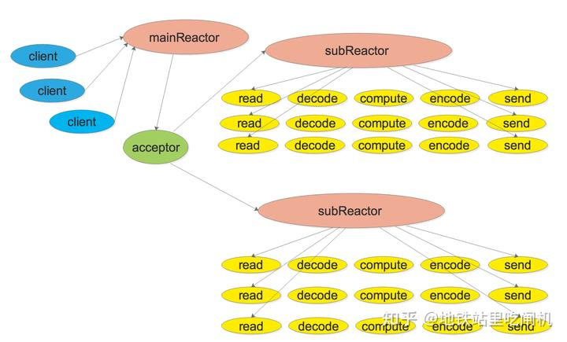

# Socket和Acceptor类

## Socket类

该类主要作用就是封装socketfd，从muduo源代码简化提取后的代码如下

```cpp
// Socket.h
#pragma once

#include "noncopyable.h"

namespace mymuduo
{

class InetAddress;

// 封装socket fd
class Socket : noncopyable {
public:
    // 防止隐式转换产生临时对象
    explicit Socket(int sockfd) : sockfd_(sockfd) {}

    ~Socket();

    int fd() const {
        return sockfd_;
    }
    void bindAddress(const InetAddress &localaddr); // 调用bind绑定服务器IP端口
    void listen(); // 调用listen监听套接字
    int accept(InetAddress *peeraddr); // 调用accept接收新客户连接请求

    void shutdownWrite(); // 调用shutdown关闭服务端写通道

    /* 以下四个函数都是调用setsockopt来设置一些socket选项 */
    void setTcpNoDelay(bool on); // 不启用naggle算法，增大对小数据包的支持
    void setReuseAddr(bool on);
    void setReusePort(bool on);
    void setKeepAlive(bool on);

private:
    const int sockfd_; // 服务器监听套接字文件描述符
};

}

// Socket.cc
#include "Socket.h"
#include "InetAddress.h"
#include "Logger.h"

#include <netinet/tcp.h>
#include <strings.h>
#include <sys/socket.h>
#include <sys/types.h>
#include <unistd.h>

namespace mymuduo {

Socket::~Socket() {
    close(sockfd_);
}

void Socket::bindAddress(const InetAddress& localaddr) {
    if (bind(sockfd_, (sockaddr*)localaddr.getSockAddr(),
             sizeof(sockaddr_in)) != 0) {
        LOG_FATAL("bind sockfd:%d fail \n", sockfd_);
    }
}

void Socket::listen() {
    // 第二个参数是accept队列大小
    if (0 != ::listen(sockfd_, 1024)) {
        LOG_FATAL("listen sockfd:%d fail \n", sockfd_);
    }
}

int Socket::accept(InetAddress* peeraddr) {
    /**
     * 1. accept函数的参数不合法
     * 2. 对返回的connfd没有设置非阻塞
     * Reactor模型 one loop per thread
     * poller + non-blocking IO
     */
    sockaddr_in addr;
    socklen_t len = sizeof addr;
    bzero(&addr, sizeof addr);
    int connfd = ::accept4(sockfd_, (sockaddr*)&addr, &len,
                           SOCK_NONBLOCK | SOCK_CLOEXEC);
    if (connfd >= 0) {
        peeraddr->setSockAddr(addr);  // 通过输出参数传出连接到的对端的地址
    } else {
        LOG_FATAL("Socket accept sockfd error! errno=%d\n", errno);
    }

    return connfd;
}

void Socket::shutdownWrite() {
    if (::shutdown(sockfd_, SHUT_WR) < 0) {
        LOG_ERROR("shutdownWrite error");
    }
}

void Socket::setTcpNoDelay(bool on) {
    int optval = on ? 1 : 0;
    ::setsockopt(sockfd_, IPPROTO_TCP, TCP_NODELAY, &optval, sizeof optval);
}

void Socket::setReuseAddr(bool on) {
    int optval = on ? 1 : 0;
    ::setsockopt(sockfd_, SOL_SOCKET, SO_REUSEADDR, &optval, sizeof optval);
}

void Socket::setReusePort(bool on) {
    int optval = on ? 1 : 0;
    ::setsockopt(sockfd_, SOL_SOCKET, SO_REUSEPORT, &optval, sizeof optval);
}

void Socket::setKeepAlive(bool on) {
    int optval = on ? 1 : 0;
    ::setsockopt(sockfd_, SOL_SOCKET, SO_KEEPALIVE, &optval, sizeof optval);
}

}  // namespace mymuduo
```

## Acceptor类

### 要点

该类封装了 `mainLoop` 持有的 `listenfd` 对应的 `Channel` ，主要工作是 负责管理`connfd`生成时将其打包成`channel`并投递到`sub eventloop`中进行事件监视,这个工作在 `Acceptor::handleRead()` 中完成.

这个类对象在muduo的`Multiple Reactors` 模型所处的位置如下



### 代码解读

```cpp
// Acceptor.h
#pragma once
#include "noncopyable.h"
#include "Socket.h"
#include "Channel.h"

#include <functional>

namespace mymuduo
{

// 前置声明
class EventLoop;
class InetAddress;

class Acceptor:noncopyable{
public:
    using NewConnectionCallback=std::function<void(int sockfd, const InetAddress&)>;

    Acceptor(EventLoop *loop, const InetAddress &listenAddr, bool reuseport);
    ~Acceptor();

    void setNewConnectionCallback(const NewConnectionCallback &cb){
        newConnectionCallback_=cb;
    }

    bool listening() const {
        return listenning_;
    }

    void listen();
private:
    void handleRead();

    EventLoop *loop_; // Acceptor用的就是用户定义的那个baseLoop，也称作mainLoop

    // 创建普通成员必须引入头文件了
    // 否则会提示不完整的类型
    // 如果是指针或引用成员，可以只加入类的前置声明，在源文件中进行包含头文件
    Socket acceptSocket_; //它负责监听的就是acceptSocket_上的事件
    Channel acceptChannel_; //将acceptSocket_封装成acceptChannel_

    NewConnectionCallback newConnectionCallback_;   //当loop_里的poller发现acceptSocket_上有事件发生时，向loop_返回acceptChannel_，Acceptor执行此回调
    bool listenning_;
    int idleFd_; //用来解决文件描述符枯竭的情况
};

}
```

```cpp
// Acceptor.cc
#include "Acceptor.h"
#include "InetAddress.h"
#include "Logger.h"

#include <errno.h>
#include <fcntl.h>
#include <sys/socket.h>
#include <sys/types.h>
#include <unistd.h>

namespace mymuduo {

static int createNonblocking() {
    int sockfd = ::socket(AF_INET, SOCK_STREAM | SOCK_NONBLOCK | SOCK_CLOEXEC,
                          IPPROTO_TCP);
    if (sockfd < 0) {
        LOG_FATAL("%s:%s:%d listen socket create err:%d \n", __FILE__,
                  __FUNCTION__, __LINE__, errno);
    }
    return sockfd;
}

Acceptor::Acceptor(EventLoop* loop,
                   const InetAddress& listenAddr,
                   bool reuseport)
    : loop_(loop),
      acceptSocket_(createNonblocking()),  // socket
      acceptChannel_(loop, acceptSocket_.fd()),
      listenning_(false),
      idleFd_(::open("/dev/null", O_RDONLY | O_CLOEXEC)) {
    acceptSocket_.setReuseAddr(true);
    acceptSocket_.setReusePort(true);
    acceptSocket_.bindAddress(listenAddr);  // bind套接字

    // TcpServer::start() Acceptor.listen
    // 有新用户的连接，要执行一个回调（connfd=》channel=》subloop）connfd打包成channel，唤醒一个subloop，来监听后序的读写事件
    // baseLoop => acceptChannel_(listenfd) =>
    acceptChannel_.setReadCallback(std::bind(&Acceptor::handleRead, this));
}

Acceptor::~Acceptor() {
    // 不关注fd上任何事件
    acceptChannel_.disableAll();
    acceptChannel_.remove();
    ::close(idleFd_);
    // acceptSocket RAII 自己会析构
}

// 由TcpServer::start()调用
void Acceptor::listen() {
    listenning_ = true;
    // listen
    acceptSocket_.listen();
    // acceptChannel_ => Poller
    acceptChannel_.enableReading();
}

// listenfd有事件发生了，就是有新用户连接了
// 接受新连接，并且以负载均衡的选择方式选择一个subEventLoop，
// 并把这个新连接分发到这个subEventLoop上。
void Acceptor::handleRead() {
    InetAddress peerAddr;
    int connfd = acceptSocket_.accept(&peerAddr);
    if (connfd >= 0) {
        if (newConnectionCallback_) {
            newConnectionCallback_(
                connfd,
                peerAddr);  // 轮询找到subLoop，唤醒，分发当前的新客户端的Channel
        } else {
            ::close(connfd);
        }
    } else {
        LOG_ERROR("%s:%s:%d accept err:%d \n", __FILE__, __FUNCTION__, __LINE__,
                  errno);

        // // 到达上限
        // if (errno == EMFILE) {
        //     LOG_ERROR("%s:%s:%d sockfd reached limit! \n", __FILE__,
        //               __FUNCTION__, __LINE__);
        // }

        // 设一个空的fd占位，当fd资源都满了后，就释放这个空fd，把来的lfd接受再立马关闭，然后再接着占位
        if (errno == EMFILE) {
            ::close(idleFd_);
            ::accept(idleFd_, nullptr, nullptr);
            ::close(idleFd_);
            idleFd_ = ::open("/dev/null", O_RDONLY | O_CLOEXEC);
        }
    }
}

}  // namespace mymuduo

```

#### errno == EMFILE处理方法

`errno == EMFILE`表明 Too many open files,常用解决方法：

+   调整当前进程的fd上限
    
+   进行集群或分布式部署了