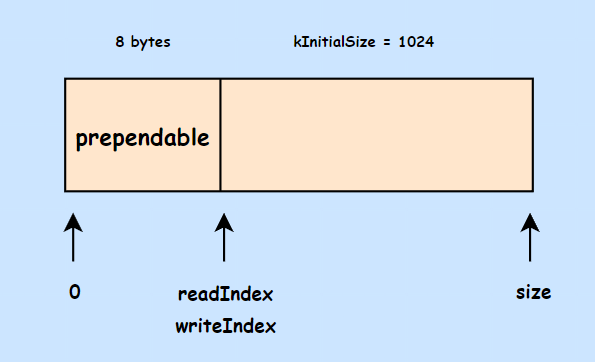
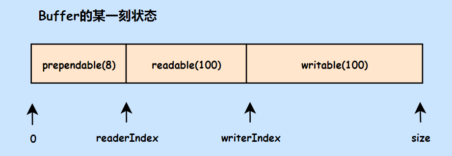
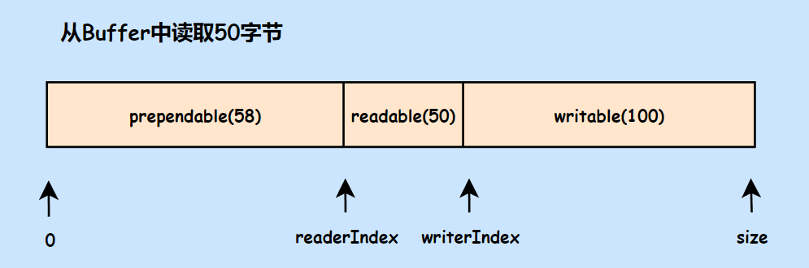
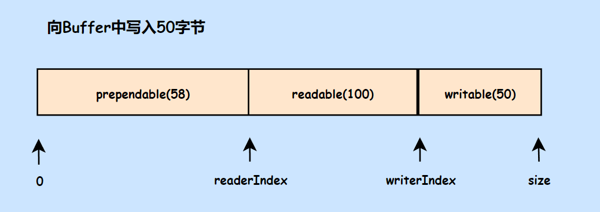
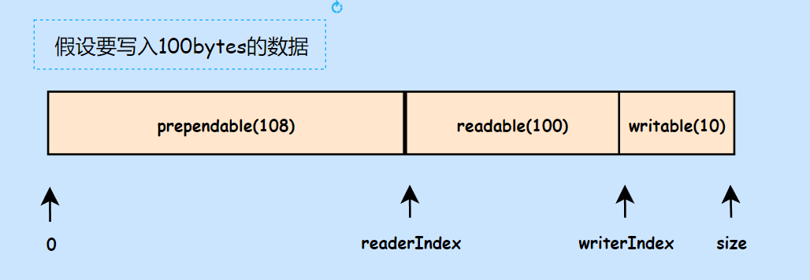
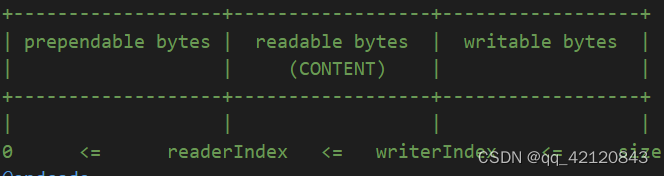

# Buffer

## 为什么要有缓冲区的设计
TcpConnection 类负责处理一个新连接的事件，包括从客户端读取数据和向客户端写数据。但是在这之前，需要先设计好缓冲区。

1. 非阻塞网络编程中应用层buffer是必须的：非阻塞IO的核心思想是避免阻塞在`read()`或`write()`或其他`I/O`系统调用上，这样可以最大限度复用`thread-of-control`，让一个线程能服务于多个`socket`连接。`I/O`线程只能阻塞在`IO-multiplexing`函数上，如`select()/poll()/epoll_wait()`。这样一来，应用层的缓冲是必须的，每个`TCP socket`都要有`inputBuffer`和`outputBuffer`。
2. TcpConnection必须有output buffer：使程序在`write()`操作上不会产生阻塞，当`write()`操作后，操作系统一次性没有接受完时，网络库把剩余数据则放入`outputBuffer`中，然后注册`POLLOUT`事件，一旦`socket`变得可写，则立刻调用`write()`进行写入数据。——应用层`buffer`到操作系统`buffer`
3. TcpConnection必须有input buffer：当发送方`send`数据后，接收方收到数据不一定是整个的数据，网络库在处理`socket`可读事件的时候，必须一次性把`socket`里的数据读完，否则会反复触发`POLLIN`事件，造成`busy-loop`。所以网路库为了应对数据不完整的情况，收到的数据先放到`inputBuffer`里。——操作系统`buffer`到应用层`buffer`。
## Buffer缓冲区设计
muduo 的 Buffer 类作为网络通信的缓冲区，像是 TcpConnection 就拥有 inputBuffer 和 outputBuffer 两个缓冲区成员。而缓冲区的设计特点：

1. 其内部使用`std::vector<char>`保存数据，并提供许多访问方法。并且`std::vector`拥有扩容空间的操作，可以适应数据的不断添加。
2. `std::vector<char>`内部分为三块，头部预留空间，可读空间，可写空间。内部使用索引标注每个空间的起始位置。每次往里面写入数据，就移动`writeIndex`；从里面读取数据，就移动`readIndex`。

### Buffer基本成员

```cpp
class Buffer : public muduo::copyable
{
public:
    static const size_t kCheapPrepend = 8; // 头部预留8个字节
    static const size_t kInitialSize = 1024; // 缓冲区初始化大小 1KB

    explicit Buffer(size_t initialSize = kInitialSize)
        : buffer_(kCheapPrepend + initialSize), // buffer分配大小 8 + 1KB
            readerIndex_(kCheapPrepend), // 可读索引和可写索引最开始位置都在预留字节后
            writerIndex_(kCheapPrepend) 
    {
        assert(readableBytes() == 0);
        assert(writableBytes() == initialSize);
        assert(prependableBytes() == kCheapPrepend);
    }

	/*......*/

	// 可读空间大小
	size_t readableBytes() const
	{ return writerIndex_ - readerIndex_; }
	
	// 可写空间大小
	size_t writableBytes() const
	{ return buffer_.size() - writerIndex_; }
	
	// 预留空间大小
	size_t prependableBytes() const
	{ return readerIndex_; }
	
	// 返回可读空间地址
	const char* peek() const
	{ return begin() + readerIndex_; }

	/*......*/
	
private:
	std::vector<char> buffer_; // 缓冲区其实就是vector<char>
	size_t readerIndex_; // 可读区域开始索引
	size_t writerIndex_; // 可写区域开始索引
};
```
### 读写数据时对Buffer的操作






### 向Buffer写入数据：readFd
`ssize_t Buffer::readFd(int fd, int* savedErrno)`：表示从 fd 中读取数据到 buffer_ 中。对于 buffer 来说这是写入数据的操作，会改变`writeIndex`。

1. 考虑到 buffer_ 的 writableBytes 空间大小，不能够一次性读完数据，于是内部还在栈上创建了一个临时缓冲区 `char extrabuf[65536];`。如果有多余的数据，就将其读入到临时缓冲区中。
2. 因为可能要写入两个缓冲区，所以使用了更加高效`readv`函数，可以向多个地址写入数据。刚开始会判断需要写入的大小。
   1. 如果一个缓冲区足够，就不必再往临时缓冲区`extrabuf`写入数据了。写入后需要更新`writeIndex`位置，`writerIndex_ += n;`。
   2. 如果一个缓冲区不够，则还需往临时缓冲区`extrabuf`写入数据。原缓冲区直接写满，`writeIndex_ = buffer_.size()`。然后往临时缓冲区写入数据，`append(extrabuf, n - writable);`。
```cpp
/**
 * inputBuffer:：TcpConnection 从 socket 读取数据，然后写入 inputBuffer
 * 这个对于buffer_来说是将数据写入的操作，所以数据在writeIndex之后
 * 客户端从 inputBuffer 读取数据。
 */
ssize_t Buffer::readFd(int fd, int* savedErrno)
{
    // saved an ioctl()/FIONREAD call to tell how much to read
    char extrabuf[65536];
    struct iovec vec[2];
    const size_t writable = writableBytes();
    /**
     * 从fd读取数据到两个地方
     * 1.writeIndex
     * 2.stack上的临时数组变量（防止不能一次性读完fd上的数据）
     */
    vec[0].iov_base = begin()+writerIndex_;
    vec[0].iov_len = writable;
    vec[1].iov_base = extrabuf;
    vec[1].iov_len = sizeof extrabuf;
    // when there is enough space in this buffer, don't read into extrabuf.
    // when extrabuf is used, we read 128k-1 bytes at most.
    // 判断需要写入几个缓冲区
    const int iovcnt = (writable < sizeof extrabuf) ? 2 : 1;
    const ssize_t n = sockets::readv(fd, vec, iovcnt);
    if (n < 0)
    {
        *savedErrno = errno;
    }
    else if (implicit_cast<size_t>(n) <= writable)
    {
        // 如果从fd读取数据长度小于buffer可写数据空间，则直接更改writerIndex索引即可
        writerIndex_ += n;
    }
    else
    {
        // buffer可写数据空间不够，还需写入extrabuf
        // writerIndex直接到尾部
        writerIndex_ = buffer_.size();
        append(extrabuf, n - writable);
    }
    // if (n == writable + sizeof extrabuf)
    // {
    //   goto line_30;
    // }
    return n;
}
```
其中的 append 函数真正向 buffer_ 内部添加数据。调用方将数据的首地址和长度给出，其内部将数据拷贝到指定位置。
```cpp
// 向buffer_添加数据
void append(const char* /*restrict*/ data, size_t len)
{
	// 确保可写空间足够
	ensureWritableBytes(len);
	// 将这段数据拷贝到可写位置之后
	std::copy(data, data+len, beginWrite());
	hasWritten(len);
}
```
### 空间不够怎么办？

如果写入空间不够，Buffer 内部会有两个方案来应付

1. 将数据往前移动：因为每次读取数据，`readIndex`索引都会往后移动，从而导致前面预留的空间逐渐增大。我们需要将后面的元素重新移动到前面。
2. 如果第一种方案的空间仍然不够，那么我们就直接对 buffer_ 进行扩容（`buffer_.resize(len)`）操作。

**如图所示：现在的写入空间不够，但是前面的预留空间加上现在的写空间是足够的。因此，我们需要将后面的数据拷贝到前面，腾出足够的写入空间。**




muduo 的代码实现：

```cpp
// 保证写空间足够len，如果不够则扩容
void ensureWritableBytes(size_t len)
{
	if (writableBytes() < len)
	{
		makeSpace(len);
	}
	assert(writableBytes() >= len);
}

// 扩容空间
void makeSpace(size_t len)
{
	// prependIndex -------------readIndex---writeIndex-
	// 
	// 因为readIndex一直往后，之前的空间没有被利用，我们可以将后面数据复制到前面
	// 如果挪位置都不够用，则只能重新分配buffer_大小
	if (writableBytes() + prependableBytes() < len + kCheapPrepend)
	{
		// FIXME: move readable data
		buffer_.resize(writerIndex_+len);
	}
	else
	{
		// move readable data to the front, make space inside buffer
		assert(kCheapPrepend < readerIndex_);
		size_t readable = readableBytes();
		std::copy(begin()+readerIndex_,
				begin()+writerIndex_,
				begin()+kCheapPrepend);
		// 读取空间地址回归最开始状态
		readerIndex_ = kCheapPrepend;
		// 可以看到这一步，写空间位置前移了
		writerIndex_ = readerIndex_ + readable;
		assert(readable == readableBytes());
	}
}
```
#### 从Buffer中读取数据
就如回声服务器的例子一样：
```cpp
void EchoServer::onMessage(const muduo::net::TcpConnectionPtr& conn,
                           muduo::net::Buffer* buf,
                           muduo::Timestamp time)
{
	// 从 buf 中读取所有数据，返回 string 类型
    muduo::string msg(buf->retrieveAllAsString());
    LOG_INFO << conn->name() << " echo " << msg.size() << " bytes, "
            << "data received at " << time.toString();
    conn->send(msg);
}
```
读取数据会调用`void retrieve(size_t len)`函数，在这之前会判断读取长度是否大于可读取空间

1. 如果小于，则直接后移`readIndex`即可，`readerIndex_ += len;`。
2. 如果大于等于，说明全部数据都读取出来。此时会将buffer置为初始状态：
   1. `readerIndex_ = kCheapPrepend;`
   2. `writerIndex_ = kCheapPrepend;`
```cpp
// 将可读取的数据按照string类型全部取出
string retrieveAllAsString()
{
	return retrieveAsString(readableBytes());
}

// string(peek(), len)
string retrieveAsString(size_t len)
{
	assert(len <= readableBytes());
	string result(peek(), len);
	retrieve(len); // 重新置位
	return result;
}

// retrieve returns void, to prevent
// string str(retrieve(readableBytes()), readableBytes());
// the evaluation of two functions are unspecified
// 读取len长度数据
void retrieve(size_t len)
{
	assert(len <= readableBytes());
	if (len < readableBytes())
	{
		// 读取长度小于可读取空间，直接更新索引
		readerIndex_ += len;
	}
	// 读取长度大于等于可读取空间
	else
	{
		retrieveAll();
	}
}

// 读取所有数据
void retrieveAll()
{
	// 全部置为初始状态
	readerIndex_ = kCheapPrepend;
	writerIndex_ = kCheapPrepend;
}

```
## TcpConnection使用Buffer
TcpConnection 拥有 inputBuffer 和 outputBuffer 两个缓冲区成员。

1. 当服务端接收客户端数据，EventLoop 返回活跃的 Channel，并调用对应的读事件处理函数，即 TcpConnection 调用 handleRead 方法从相应的 fd 中读取数据到 inputBuffer 中。在 Buffer 内部 inputBuffer 中的 writeIndex 向后移动。
2. 当服务端向客户端发送数据，TcpConnection 调用 handleWrite 方法将 outputBuffer 的数据写入到 TCP 发送缓冲区。outputBuffer 内部调用 `retrieve` 方法移动 readIndex 索引。


### TcpConnection接收客户端数据（从客户端sock读取数据到inputBuffer）

1. 调用`inputBuffer_.readFd(channel_->fd(), &savedErrno);`将对端`fd`数据读取到`inputBuffer`中。
   1. 如果读取成功，调用「可读事件发生回调函数」
   2. 如果读取数据长度为`0`，说明对端关闭连接。调用`handleCose()`
   3. 出错，则保存`errno`，调用`handleError()`
```cpp
/**
 * 消息读取，TcpConnection从客户端读取数据
 * 调用Buffer.readFd(fd, errno) -> 内部调用readv将数据从fd读取到缓冲区 -> inputBuffer
 */
void TcpConnection::handleRead(Timestamp receiveTime)
{
    loop_->assertInLoopThread();
    int savedErrno = 0;
    // 将 channel_->fd() 数据读取到 inputBuffer_ 中，出错信息保存到 savedErrno 中
    ssize_t n = inputBuffer_.readFd(channel_->fd(), &savedErrno);
    if (n > 0)
    {
        // 已建立连接的用户，有可读事件发生，调用用户传入的回调操作onMessage
        messageCallback_(shared_from_this(), &inputBuffer_, receiveTime);
    }
    // 读取不到数据，关闭此连接
    else if (n == 0)
    {
        handleClose();
    }
    // 出错
    else
    {
        errno = savedErrno;
        LOG_SYSERR << "TcpConnection::handleRead";
        handleError();
    }
}
```
### TcpConnection向客户端发送数据（将ouputBuffer数据输出到socket中）
```cpp
// 此行代码的用意何在
if (channel_->isWriting())
```

1. 要在`channel_`确实关注写事件的前提下正常发送数据：因为一般有一个`send`函数发送数据，如果TCP接收缓冲区不够接收ouputBuffer的数据，就需要多次写入。需要重新注册写事件，因此是在注册了写事件的情况下调用的`handleWrite`。
2. 向`channel->fd()`发送outputBuffer中的可读取数据。成功发送数据则移动`readIndex`，并且如果一次性成功写完数据，就不再让此`channel`关注写事件了，并调用写事件完成回调函数没写完则继续关注！
```cpp
void TcpConnection::handleWrite()
{
    loop_->assertInLoopThread();
    // channel关注了写事件
    if (channel_->isWriting())
    {
        // 向客户端fd写数据，[peek, peek + readable)
        ssize_t n = sockets::write(channel_->fd(),
                                    outputBuffer_.peek(),
                                    outputBuffer_.readableBytes());
        // 成功写入数据
        if (n > 0)
        {
            // 重置readIndex位置，向后移动n，表示这n个字节的数据都被读取出来了
            outputBuffer_.retrieve(n);
            // 缓冲区可读空间为0，说明 writeIndex - readIndex = 0
            // 我们一次性将数据写完了
            if (outputBuffer_.readableBytes() == 0)
            {
                // channel不再关注写事件
                channel_->disableWriting();
                if (writeCompleteCallback_)
                {
                    // 调用用户自定义的写完成事件函数
                    loop_->queueInLoop(std::bind(writeCompleteCallback_, shared_from_this()));
                }
                if (state_ == kDisconnecting)
                {
                    // TcpCOnnection关闭写端
                    shutdownInLoop();
                }
            }
        }
        else
        {
            LOG_SYSERR << "TcpConnection::handleWrite";
            // if (state_ == kDisconnecting)
            // {
            //   shutdownInLoop();
            // }
        }
    }
    else
    {
        LOG_TRACE << "Connection fd = " << channel_->fd()
                    << " is down, no more writing";
    }
}
```


## 要点

由于Muduo库使用的是**非阻塞IO**模型，即每次`send()` 不一定全发完，没发完的数据要用一个容器进行接收,所以必须要实现应用层缓冲区.

缓冲区中各个指针和区域,下图要牢牢记住:



其中`prependable bytes` 通常用于解决**粘包**，`kCheapPrepend`是为了在序列化的时候可以便宜的在首部增加几个字节而不必腾挪 `std::vector<char>` 的内部空间。

缓冲区底层使用 `std::vector<char>`利用其动态扩容的机制。

> 注意读写缓冲区 都有readerIndex 和 writerIndex!!!
>
> 而不是读缓冲区没有writerIndex,写缓冲区没有readerIndex

注:利用 `readv` 分散读，利用 `writev` 可聚集写（将多个分散的缓冲区聚集写）

## 完整代码

> Buffer.h

```cpp

#pragma once

#include <algorithm>
#include <string>
#include <vector>

namespace mymuduo {

/// A buffer class modeled after org.jboss.netty.buffer.ChannelBuffer
///
/// @code
/// +-------------------+------------------+------------------+
/// | prependable bytes |  readable bytes  |  writable bytes  |
/// |                   |     (CONTENT)    |                  |
/// +-------------------+------------------+------------------+
/// |                   |                  |                  |
/// 0      <=      readerIndex   <=   writerIndex    <=     size
/// @endcode

// 网络库底层的缓冲器类型定义
class Buffer {
public:
    // 记录数据包长度的大小
    static const size_t kCheapPrepend = 8;
    // 数据包后面缓冲区的大小
    static const size_t kInitialSize = 1024;

    // 同样不允许默认生成对象
    // readerIndex_/writerIndex_没有数据先指向一个地方
    explicit Buffer(size_t initialSize = kInitialSize)
        : buffer_(kCheapPrepend + initialSize),
          readerIndex_(kCheapPrepend),
          writerIndex_(kCheapPrepend) {}

    size_t readableBytes() const { return writerIndex_ - readerIndex_; }

    size_t writableBytes() const { return buffer_.size() - writerIndex_; }

    // 0-readerIndex_
    size_t prependableBytes() const { return readerIndex_; }

    // 返回缓冲区中可读数据的起始地址
    const char* peek() const { return begin() + readerIndex_; }

    // 把数据从buffer转成C++的string类型
    // onMessage string <- Buffer
    void retrieve(size_t len) {
        if (len < readableBytes()) {
            // 应用只读取了刻度缓冲区数据的一部分，就是len，还剩下
            // readerIndex_+=len -> writerIndex_有数据没读
            readerIndex_ += len;
        } else {
            // len==readableBytes
            retrieveAll();
        }
    }

    void retrieveAll() {
        // 没的读了，可读的已经读完了，把writerIndex拉到readIndex相当于复位了
        readerIndex_ = writerIndex_ = kCheapPrepend;
    }

    // 把onMessage函数上报的Buffer数据，转成string类型的数据返回
    // 取出所有 readable 的数据转换为string返回
    std::string retrieveAllAsString() {
        return retrieveAsString(readableBytes());  // 应用可读取数据的长度
    }

    std::string retrieveAsString(size_t len) {
        // 构造了一个result
        std::string result(peek(), len);  // 应用可读取数据的长度

        // 读完缓冲区各个指针要置位
        retrieve(
            len);  // 上面一句把缓冲区中可读的数据，已经读取出来，这里肯定要对缓冲区进行复位操作
        return result;
    }

    // 确保有长度为len的写缓冲区可用
    // buffer_.size() - writerIndex_    len
    void ensureWriteableBytes(size_t len) {
        if (writableBytes() < len) {
            makeSpace(len);  // 扩容函数
        }
    }

    // 复制整串字符串
    void append(const std::string& str) { append(str.c_str(), str.size()); }

    // 把[data, data+len]内存上的数据，添加到writable缓冲区当中
    void append(const char* data, size_t len) {
        ensureWriteableBytes(len);
        // 把要添加的数据拷贝到可写的缓冲区里面
        std::copy(data, data + len, beginWrite());
        // 移动缓冲区可写的起始位置
        writerIndex_ += len;
    }

    const char* findCRLF() const {
        // 使用 std::search() 函数在缓冲区的当前读位置（peek()
        // 返回的值）和写位置（beginWrite() 返回的值）之间查找回车换行符（由
        // kCRLF 和 kCRLF + 2 表示）
        const char* crlf = std::search(peek(), beginWrite(), kCRLF, kCRLF + 2);
        // 如果找到了回车换行符，则返回它在缓冲区中的指针；否则，返回 NULL
        return crlf == beginWrite() ? NULL : crlf;
    }

    const char* findCRLF(const char* start) const {
        const char* crlf = std::search(start, beginWrite(), kCRLF, kCRLF + 2);
        return crlf == beginWrite() ? NULL : crlf;
    }

    // 用于从缓冲区中取出数据直到指定位置
    // 接受一个 const char* 类型的参数
    // end，表示要取出数据的结束位置。通过计算要取出的数据长度（end-peek()），
    // 调用 retrieve() 函数将该长度的数据从缓冲区中取出。
    void retrieveUntil(const char* end) { retrieve(end - peek()); }

    char* beginWrite() { return begin() + writerIndex_; }

    const char* beginWrite() const { return begin() + writerIndex_; }

    // ssize表示有符号数据
    // 从fd上读取数据
    ssize_t readFd(int fd, int* saveErrno);
    // 通过fd发送数据
    ssize_t writeFd(int fd, int* saveErrno);

private:
    char* begin() {
        // it.operator*()
        // 解引用后取地址
        // vector底层数组首元素的地址，也就是数组的起始地址
        // 也可以用buffer_.data()
        return &*buffer_.begin();
    }

    const char* begin() const { return &*buffer_.begin(); }

    // 扩充写缓冲区空间
    void makeSpace(size_t len) {
        // 所有剩下可写的还是不够
        if (writableBytes() + prependableBytes() < len + kCheapPrepend) {
            // 至少有len的空间有的写
            buffer_.resize(writerIndex_ + len);
        } else {
            // 可读的数据
            size_t readalbe = readableBytes();
            // 可读但是还没用的空间，拷贝到begin()+kCheapPrepend
            // 这样把前面已经读过的数据的空间覆盖掉了
            std::copy(begin() + readerIndex_, begin() + writerIndex_,
                      begin() + kCheapPrepend);
            readerIndex_ = kCheapPrepend;
            writerIndex_ = readerIndex_ + readalbe;
        }
    }

    std::vector<char> buffer_;
    // 注意：读写缓冲区都有可读和可写起始位置！！！
    size_t readerIndex_;  // 可读数据起始位置
    size_t writerIndex_;  // 可写入起始位置

    static const char kCRLF[];
};

}  // namespace mymuduo
```

>  Buffer.cc

```cpp

#include "Buffer.h"

#include <errno.h>
#include <sys/uio.h>
#include <unistd.h>

namespace mymuduo
{


const char Buffer::kCRLF[] = "\r\n";

/**
 * 从fd上读取数据 Poller工作在LT模式(数据没有读完的话，底层poller会不断地去上报)
 * Buffer缓冲区是有大小的！ 但是从fd上读数据的时候，却不知道tcp数据最终的大小
 */
ssize_t Buffer::readFd(int fd, int* saveErrno) {
    char extrabuf[65536] = {0};  // 栈上的内存空间 64K
    struct iovec vec[2];

    const size_t writable =
        writableBytes();  // 这是Buffer底层缓冲区剩余的可写空间大小
    // 可填就只用第一块
    // 第一块缓冲区
    vec[0].iov_base = begin() + writerIndex_;
    vec[0].iov_len = writable;

    // 第二块缓冲区
    // 不够填，就要把数据放在栈里面
    vec[1].iov_base = extrabuf;
    vec[1].iov_len = sizeof extrabuf;

    // writable < sizeof extrabuf 表示底层可写的缓冲区空间不够大，用两块
    const int iovcnt = (writable < sizeof extrabuf) ? 2 : 1;
    // 数组名vec本身就是地址
    // readv可以从文件描述符fd中读取数据到多个缓冲区中，分散读
    const ssize_t n = ::readv(fd, vec, iovcnt);
    if (n < 0) {
        *saveErrno = errno;
    } else if (n <= writable)  // Buffer的可写缓冲区已经够存储读出来的数据了
    {
        // 读数据writerIndex_后移
        writerIndex_ += n;
    } else {
        // Buffer空间不够存，需要把溢出的部分（extrabuf）倒到Buffer中（会先触发扩容机制）
        // extrabuf里面也写入了数据
        writerIndex_ = buffer_.size();
        // Buffer已经存了writable个数据
        append(extrabuf,
               n - writable);  // writerIndex_开始写 n - writable大小的数据
    }

    return n;
}

// 通过fd发送数据
ssize_t Buffer::writeFd(int fd, int* saveErrno) {
    // 可读的数据通过fd发出去
    ssize_t n = ::write(fd, peek(), readableBytes());
    if (n < 0) {
        // 出错了返回errno
        *saveErrno = errno;
    }
    return n;
}

}   
```

