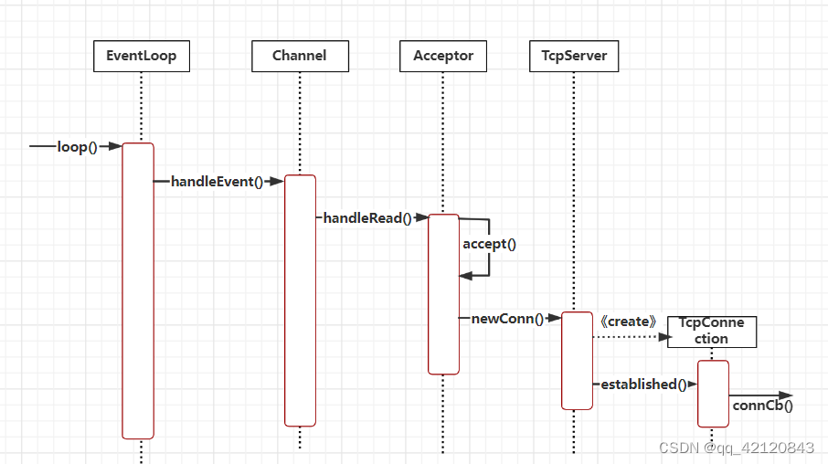

# TcpServer类

## 要点

TcpServer类的主要作用是，管理整个服务器，做如下的一些操作：

+   管理`accept(2)` 获得的 `TcpConnection`
+   TcpServer是供用户直接使用的，生命期由用户控制
+   设置 `mainLoop`,并利用 mainLoop 进行新连接的管理
+   初始化TcpServer对应的 `Acceptor` 用于监听新连接到来
+   根据 `one loop per thread`的设计方案，`setThreadNum` 设置**线程数**来创建对应的`eventLoop`
+   用户调用`TcpServer::start()` 使得所有`subLoop`都开始 `loop`（即`epoll_wait()`）
+   实现**连接到来时**的处理
    +   打包`connfd`为`TcpConnection`
    +   设置回调（连接到来、读写消息到来、写完成）
    +   它保存用户提供的  
        ConnectionCallback和MessageCallback，在新建TcpConnection的时候会  
        原样传给后者
    +   执行连接建立完成的回调（向poller注册channel的epollin事件）
+   `TcpConnection` 移除的任务处理

muduo利用每个subloop上设置一个`wakeupfd_`，使得`mainloop`通知`subloop`进行事件检测`epoll_wait`, 这相比于用一个**生产者消费者队列**效率更高（即生产者往队列放任务（IO逻辑处理），唤醒生产者）

### 当一条新连接建立时的函数调用顺序



`newconn()` 代表 `TcpServer::newConnection`

`established()`代表 `TcpConnection::connectEstablished()`

muduo尽量让**依赖是单向**的，TcpServer会用到Acceptor，但Acceptor并不知道TcpServer的存在。TcpServer会创建TcpConnection，但TcpConnection并不知道TcpServer的存在.

## 重点代码讲解

```cpp
// TcpServer.h
#pragma once

/**
 * 用户使用muduo编写服务器程序
 * 把头文件在对外TcpServer包含了，用户会更好使用
 */
#include "Acceptor.h"
#include "Buffer.h"
#include "Callbacks.h"
#include "EventLoop.h"
#include "EventLoopThreadPool.h"
#include "InetAddress.h"
#include "TcpConnection.h"
#include "noncopyable.h"

#include <atomic>
#include <functional>
#include <memory>
#include <string>
#include <unordered_map>

namespace mymuduo
{

// 对外的服务器编程使用的类
// 在这个类对象里设置连接的事件回调操作
class TcpServer : noncopyable {
public:
    using ThreadInitCallback = std::function<void(EventLoop*)>;

    enum Option {
        kNoReusePort,
        kReusePort,
    };

    TcpServer(EventLoop* loop,
              const InetAddress& listenAddr,
              const std::string& nameArg,
              Option option = kNoReusePort);
    ~TcpServer();

    void setThreadInitcallback(const ThreadInitCallback& cb) {
        threadInitCallback_ = cb;
    }
    void setConnectionCallback(const ConnectionCallback& cb) {
        connectionCallback_ = cb;
    }
    void setMessageCallback(const MessageCallback& cb) {
        messageCallback_ = cb;
    }
    void setWriteCompleteCallback(const WriteCompleteCallback& cb) {
        writeCompleteCallback_ = cb;
    }

    // 设置底层subloop的个数
    void setThreadNum(int numThreads);

    // 开启服务器监听
    void start();

    EventLoop* getLoop() const { return loop_; }
    std::string name() const { return name_; }
    std::string ipPort() const { return ipPort_; }

private:
    void newConnection(int sockfd, const InetAddress& peerAddr);
    // 在map中移除TcpConnection
    void removeConnection(const TcpConnectionPtr& conn);
    void removeConnectionInLoop(const TcpConnectionPtr& conn);

    using ConnectionMap = std::unordered_map<std::string, TcpConnectionPtr>;

    EventLoop* loop_;  // baseLoop 用户定义的loop

    const std::string ipPort_;
    const std::string name_;

    std::unique_ptr<Acceptor>
        acceptor_;  // 运行在mainLoop，任务就是监听新连接事件

    std::shared_ptr<EventLoopThreadPool> threadPool_;  // one loop per thread

    ConnectionCallback connectionCallback_;  // 有新连接时的回调
    MessageCallback messageCallback_;        // 有读写消息时的回调
    WriteCompleteCallback writeCompleteCallback_;  // 消息发送完成以后的回调

    ThreadInitCallback threadInitCallback_;  // loop线程初始化的回调

    std::atomic_int started_;

    int nextConnId_;
    ConnectionMap connections_;  // 保存所有的连接
};

}
```

```cpp
// TcpServer.cc
#include "TcpServer.h"
#include "Logger.h"
#include "TcpConnection.h"

#include <strings.h>
#include <functional>

namespace mymuduo
{
static EventLoop* CheckLoopNotNull(EventLoop* loop) {
    if (loop == nullptr) {
        LOG_FATAL("%s:%s:%d mainLoop is null! \n", __FILE__, __FUNCTION__,
                  __LINE__);
    }
    return loop;
}

TcpServer::TcpServer(EventLoop* loop,
                     const InetAddress& listenAddr,
                     const std::string& nameArg,
                     Option option)
    : loop_(CheckLoopNotNull(loop)),
      ipPort_(listenAddr.toIpPort()),
      name_(nameArg),
      acceptor_(new Acceptor(loop, listenAddr, option == kReusePort)),
      threadPool_(new EventLoopThreadPool(loop, name_)),
      connectionCallback_(),
      messageCallback_(),
      nextConnId_(1),
      started_(0) {
    // 当有先用户连接时，会执行TcpServer::newConnection回调
    acceptor_->setNewConnectionCallback(std::bind(&TcpServer::newConnection, this, 
                                        std::placeholders::_1, std::placeholders::_2));
}

TcpServer::~TcpServer() {
    for (auto& item : connections_) {
        // 这个局部的shared_ptr智能指针对象，出右中括号（当前代码块），可以自动释放new出来的TcpConnection对象资源了
        // 下一行reset释放后用不了item.second
        TcpConnectionPtr conn(item.second);
        item.second.reset();

        // 销毁连接
        conn->getLoop()->runInLoop(
            std::bind(&TcpConnection::connectDestroyed, conn));
    }
}

// 设置底层subloop的个数
void TcpServer::setThreadNum(int numThreads) {
    threadPool_->setThreadNum(numThreads);
}

// 开启服务器监听   loop.loop()
void TcpServer::start() {
    if (started_++ == 0)  // 防止一个TcpServer对象被start多次
    {
        // 把subpool都启动起来
        // threadInitCallback_线程初始化的回调
        threadPool_->start(threadInitCallback_);  // 启动底层的loop线程池
        // 执行 Acceptor::listen
        loop_->runInLoop(std::bind(&Acceptor::listen, acceptor_.get()));
    }
}

// 有一个新的客户端的连接，acceptor会执行这个回调操作
void TcpServer::newConnection(int sockfd, const InetAddress& peerAddr) {
    // 轮询算法，选择一个shubloop，来管理channel
    EventLoop* ioLoop = threadPool_->getNextLoop();
    char buf[64] = {0};
    snprintf(buf, sizeof buf, "-%s#%d", ipPort_.c_str(), nextConnId_);
    ++nextConnId_;
    std::string connName = name_ + buf;

    LOG_INFO("TcpServer::newConnection [%s] - new connection [%s] from %s \n",
             name_.c_str(), connName.c_str(), peerAddr.toIpPort().c_str());

    // 通过sockfd获取其绑定的本机的ip地址和端口信息
    sockaddr_in local;
    ::bzero(&local, sizeof local);
    socklen_t addrlen = sizeof local;
    if (::getsockname(sockfd, (sockaddr*)&local, &addrlen) < 0) {
        LOG_ERROR("sockets::getLocalAddr");
    }
    InetAddress localAddr(local);

    // 根据连接成功的sockfd，创建TcpConnection连接对象
    // sockfd: Socket Channel
    TcpConnectionPtr conn(
        new TcpConnection(ioLoop, connName, sockfd, localAddr, peerAddr));
    connections_[connName] = conn;
    // 下面的回调都是用户设置给TcpServer=>TcpConnection=>Channel=>Poller=>notify
    // channel调用回调
    conn->setConnectionCallback(connectionCallback_);
    conn->setMessageCallback(messageCallback_);
    conn->setWriteCompleteCallback(writeCompleteCallback_);

    // 设置了如何关闭连接的回调   conn->shutDown()
    conn->setCloseCallback(
        std::bind(&TcpServer::removeConnection, this, std::placeholders::_1));

    // 直接调用TcpConnection::connectEstablished
    ioLoop->runInLoop(std::bind(&TcpConnection::connectEstablished, conn));
}

void TcpServer::removeConnection(const TcpConnectionPtr& conn) {
    loop_->runInLoop(std::bind(&TcpServer::removeConnectionInLoop, this, conn));
}

void TcpServer::removeConnectionInLoop(const TcpConnectionPtr& conn) {
    LOG_INFO("TcpServer::removeConnectionInLoop [%s] - connection %s\n",
             name_.c_str(), conn->name().c_str());

    size_t n = connections_.erase(conn->name());
    EventLoop* ioLoop = conn->getLoop();
    ioLoop->queueInLoop(std::bind(&TcpConnection::connectDestroyed, conn));
}

}
```

