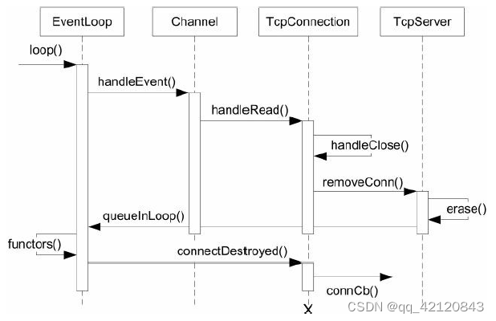

## TcpConnection类

### 要点

`TcpConnection`表示的是“**一次TCP连接**”，它是不可再生的，一旦连接断开，这个`TcpConnection`对象就没啥用了。它的主要功能就是对 **成功连接服务器的客户连接connfd** 的封装。

一个`TcpConnection` 唯一对应一个`Channel`和`Socket`

`Channel`处理事件的一系列回调就是在 `TcpConnection`类中设置和实现的。

#### TcpConnection断开连接

muduo只有一种关闭连接的方式：**被动关闭**。即对方先关闭连接，本地`read(2)`返回0，触发关闭逻辑。函数调用流程如下



#### 实现代码

代码量比较大，但是逻辑比较简单

```cpp
// TcpConnection.h
#pragma once

#include "Buffer.h"
#include "Callbacks.h"
#include "InetAddress.h"
#include "Timestamp.h"
#include "noncopyable.h"

#include <atomic>
#include <memory>
#include <string>
#include <any>

namespace mymuduo
{
// 前置声明
class Channel;
class EventLoop;
class Socket;

// TcpConnection和socket打包成Channel，扔给poller
// poller在监听到channel上有事件发生以后，就会去回调
// 这些callback都是channel从Tcpconnection拿过来的
// 用户给Tcpserver，Tcpserver再给Tcpconnection，Tcpconnection最终把这些东西设置给channel，channel就可以加入poller，poller监听到channel有相应事件发生，channel就会执行相应的回调

/**
 * TcpServer => Acceptor => 有一个新用户连接，通过accept函数拿到connfd
 * =》 TcpConnection 设置回调 =》 Channel =》 Poller =》 Channel的回调操作
 *
 */
// 对成功与服务器建立连接所得的connfd的封装
class TcpConnection : noncopyable,
                      public std::enable_shared_from_this<TcpConnection> {
public:
    // sockfd是TcpServer给我的
    TcpConnection(EventLoop* loop,
                  const std::string& name,
                  int sockfd,
                  const InetAddress& localAddr,
                  const InetAddress& peerAddr);
    ~TcpConnection();

    EventLoop* getLoop() const { return loop_; }
    // getLoopName
    const std::string& name() const { return name_; }
    const InetAddress& localAddress() const { return localAddr_; }
    const InetAddress& peerAddress() const { return peerAddr_; }

    // 是否已连接
    bool connected() const { return state_ == kConnected; }

    // 发送数据
    void send(const std::string& buf);
    // 关闭连接，外部要调用的不能写到私有里面
    void shutdown();
    void setTcpNoDelay(bool on);

    void setConnectionCallback(const ConnectionCallback& cb) {
        connectionCallback_ = cb;
    }

    void setMessageCallback(const MessageCallback& cb) {
        messageCallback_ = cb;
    }

    void setWriteCompleteCallback(const WriteCompleteCallback& cb) {
        writeCompleteCallback_ = cb;
    }

    void setHighWaterMarkCallback(const HighWaterMarkCallback& cb,
                                  size_t highWaterMark) {
        highWaterMarkCallback_ = cb;
        highWaterMark_ = highWaterMark;
    }

    void setCloseCallback(const CloseCallback& cb) { closeCallback_ = cb; }

    // 连接建立
    void connectEstablished();
    // 连接销毁
    void connectDestroyed();

    void setContext(const std::any& context) { context_ = context; }
    const std::any& getContext() const { return context_; }

    std::any* getMutableContext() { return &context_; }

private:
    enum StateE { kDisconnected, kConnecting, kConnected, kDisconnecting };
    void setState(StateE state) { state_ = state; }

    void handleRead(Timestamp receiveTime);
    void handleWrite();
    void handleClose();
    void handleError();

    void sendInLoop(const void* message, size_t len);
    void shutdownInLoop();

    // 这里绝对不是baseLoop,因为TcpConnection都是在subLoop里面管理的
    EventLoop* loop_;
    const std::string name_;
    std::atomic_int state_;
    bool reading_;

    // 这里和Acceptor类似   Acceptor=》mainLoop    TcpConenction=》subLoop
    std::unique_ptr<Socket> socket_;
    std::unique_ptr<Channel> channel_;

    // 当前主机
    const InetAddress localAddr_;
    // 对端的
    const InetAddress peerAddr_;

    ConnectionCallback connectionCallback_;  // 有新连接时的回调
    MessageCallback messageCallback_;        // 有读写消息时的回调
    WriteCompleteCallback writeCompleteCallback_;  // 消息发送完成以后的回调
    HighWaterMarkCallback highWaterMarkCallback_;
    CloseCallback closeCallback_;
    size_t highWaterMark_;  // 指定多少算水位线

    Buffer inputBuffer_;   // 接收数据的缓冲区
    Buffer outputBuffer_;  // 发送数据的缓冲区
    std::any context_;
};

}
```

```cpp
// TcpConnection.cc
#include "TcpConnection.h"
#include "Channel.h"
#include "EventLoop.h"
#include "Logger.h"
#include "Socket.h"

#include <errno.h>
#include <netinet/tcp.h>
#include <strings.h>
#include <sys/socket.h>
#include <sys/types.h>
#include <functional>
#include <string>

namespace mymuduo {
// 写个静态的，不会因为编译名字冲突
static EventLoop* CheckLoopNotNull(EventLoop* loop) {
    if (loop == nullptr) {
        LOG_FATAL("%s:%s:%d TcpConnection Loop is null! \n", __FILE__,
                  __FUNCTION__, __LINE__);
    }
    return loop;
}

// kConnecting正在连接的初始状态
TcpConnection::TcpConnection(EventLoop* loop,
                             const std::string& nameArg,
                             int sockfd,
                             const InetAddress& localAddr,
                             const InetAddress& peerAddr)
    : loop_(CheckLoopNotNull(loop)),
      name_(nameArg),
      state_(kConnecting),
      reading_(true),
      socket_(new Socket(sockfd)),
      channel_(new Channel(loop, sockfd)),
      localAddr_(localAddr),
      peerAddr_(peerAddr),
      highWaterMark_(64 * 1024 * 1024)  // 64M
{
    // 下面给channel设置相应的回调函数，poller给channel通知感兴趣的事件发生了，channel会回调相应的操作函数
    channel_->setReadCallback(
        std::bind(&TcpConnection::handleRead, this, std::placeholders::_1));
    channel_->setWriteCallback(std::bind(&TcpConnection::handleWrite, this));
    channel_->setCloseCallback(std::bind(&TcpConnection::handleClose, this));
    channel_->setErrorCallback(std::bind(&TcpConnection::handleError, this));

    // c字符串
    LOG_INFO("TcpConnection::ctor[%s] at fd=%d\n", name_.c_str(), sockfd);
    // 启动tcpserver的保护机制
    socket_->setKeepAlive(true);
}

TcpConnection::~TcpConnection() {
    LOG_INFO("TcpConnection::dtor[%s] at fd=%d state=%d \n", name_.c_str(),
             channel_->fd(), (int)state_);
}

void TcpConnection::handleRead(Timestamp receiveTime) {
    int savedErrno = 0;
    ssize_t n = inputBuffer_.readFd(channel_->fd(), &savedErrno);
    if (n > 0) {
        // 已建立连接的用户，有可读事件发生了，调用用户传入的回调操作onMessage
        messageCallback_(shared_from_this(), &inputBuffer_, receiveTime);
    } else if (n == 0) {
        // 出错了，close
        handleClose();
    } else {
        errno = savedErrno;
        LOG_ERROR("TcpConnection::handleRead");
        handleError();
    }
}

void TcpConnection::handleWrite() {
    if (channel_->isWriting()) {
        int savedErrno = 0;
        ssize_t n = outputBuffer_.writeFd(channel_->fd(), &savedErrno);
        if (n > 0) {
            // 表示有数据发送成功
            outputBuffer_.retrieve(n);
            if (outputBuffer_.readableBytes() == 0) {
                channel_->disableWriting();
                if (writeCompleteCallback_) {
                    // 唤醒loop_对应的thread线程，执行回调
                    loop_->queueInLoop(
                        std::bind(writeCompleteCallback_, shared_from_this()));
                }
                // 在当前所属的loop里面，把这个TcpConnection删除掉
                if (state_ == kDisconnecting) {
                    shutdownInLoop();
                }
            }
        } else {
            LOG_ERROR("TcpConnection::handleWrite");
        }
    } else {
        // channel并不是可写的
        LOG_ERROR("TcpConnection fd=%d is down, no more writing \n",
                  channel_->fd());
    }
}

// poller => channel::closeCallback => TcpConnection::handleClose
void TcpConnection::handleClose() {
    LOG_INFO("fd=%d state=%d \n", channel_->fd(), (int)state_);
    setState(kDisconnected);
    // 对所有的事件都不感兴趣了，从epoll上通过epoll_ctrl全部删掉
    channel_->disableAll();

    TcpConnectionPtr connPtr(shared_from_this());
    connectionCallback_(connPtr);  // 执行连接关闭的回调
    closeCallback_(
        connPtr);  // 关闭连接的回调 执行的是TcpServer::removeConnection回调方法
}

void TcpConnection::handleError() {
    int optval;
    socklen_t optlen = sizeof optval;
    int err = 0;
    if (::getsockopt(channel_->fd(), SOL_SOCKET, SO_ERROR, &optval, &optlen) <
        0) {
        err = errno;
    } else {
        err = optval;
    }
    LOG_ERROR("TcpConnection::handleError name:%s - SO_ERROR:%d \n",
              name_.c_str(), err);
}

// 干脆直接提供string作为参数，用户用起来方便一点
void TcpConnection::send(const std::string& buf) {
    if (state_ == kConnected) {
        if (loop_->isInLoopThread()) {
            sendInLoop(buf.c_str(), buf.size());
        } else {
            // 唤醒Loop所属线程执行send
            loop_->runInLoop(std::bind(&TcpConnection::sendInLoop, this,
                                       buf.c_str(), buf.size()));
        }
    }
}

/**
 * 发送数据时，若应用写的快，而内核发送数据慢，需要把待发送数据写入缓冲区，
 * 而且设置了水位回调
 */
void TcpConnection::sendInLoop(const void* data, size_t len) {
    ssize_t nwrote = 0;
    size_t remaining = len;  // 每一次写后，剩余没写的数据量
    bool faultError = false;

    // 之前调用过该connection的shutdown，不能再进行发送了
    if (state_ == kDisconnected) {
        LOG_ERROR("disconnected, give up writing!");
        return;
    }

    // !!if no thing in output queue, try writing directly
    // 表示channel_第一次开始写数据， 且缓冲区无待发数据,则可以直接发data数据
    // 否则要将数据加入到 outputBuffer_ 后发送
    if (!channel_->isWriting() && outputBuffer_.readableBytes() == 0) {
        // 那就开始发送
        nwrote = ::write(channel_->fd(), data, len);
        if (nwrote >= 0) {
            remaining = len - nwrote;
            if (remaining == 0 && writeCompleteCallback_) {
                // 既然在这里数据全部发送完成，就不用再给channel设置epollout事件了
                loop_->queueInLoop(
                    std::bind(writeCompleteCallback_, shared_from_this()));
            }
        } else {
            // nwrote < 0
            nwrote = 0;
            // EWOULDBLOCK没有数据的正常返回
            if (errno != EWOULDBLOCK) {
                LOG_ERROR("TcpConnection::sendInLoop");
                if (errno == EPIPE || errno == ECONNRESET)  // SIGPIPE  RESET
                {
                    // 有错误发生
                    faultError = true;
                }
            }
        }
    }

    // 说明当前这一次write，并没有把数据全部发送出去，剩余的数据需要保存到缓冲区当中，然后给channel
    // 注册epollout事件，poller发现tcp的发送缓冲区有内容可发，会通知相应的sock-channel，调用Channel::writeCallback_回调方法
    // 也就是调用TcpConnection::handleWrite方法，把发送缓冲区中的数据全部发送完成
    if (!faultError && remaining > 0) {
        // 目前发送缓冲区剩余的待发送数据的长度
        size_t oldLen = outputBuffer_.readableBytes();
        // 上一次若已经超过高水位，不需要调用回调
        if (oldLen + remaining >= highWaterMark_ && oldLen < highWaterMark_ &&
            highWaterMark_) {
            loop_->queueInLoop(std::bind(highWaterMarkCallback_,
                                         shared_from_this(),
                                         oldLen + remaining));
        }
        outputBuffer_.append((char*)data + nwrote, remaining);
        if (!channel_->isWriting()) {
            channel_
                ->enableWriting();  // 这里一定要注册channel的写事件，否则poller不会给channel通知epollout
        }
    }
}

// 每一个loop所执行的方法，都要在loop对应的线程里去处理
void TcpConnection::shutdown() {
    if (state_ == kConnected) {
        setState(kDisconnecting);
        loop_->runInLoop(std::bind(&TcpConnection::shutdownInLoop, this));
    }
}

void TcpConnection::setTcpNoDelay(bool on) {
    socket_->setTcpNoDelay(on);
}

void TcpConnection::shutdownInLoop() {
    // 保证优雅关闭，发完数据才关闭
    // 不关注channel_的写事件了，表明outputBuffer中数据已全部发送完成
    if (!channel_->isWriting()) {
        // 说明outputBuffer中的数据已经全部发送完成
        socket_->shutdownWrite();  // 关闭写端
    }
}

// 连接建立
// TcpConnection是直接给到用户手里
// channel、socket、acceptor是不会直接给到用户手里的
void TcpConnection::connectEstablished() {
    setState(kConnected);
    // 检测Channel对应的TcpConnection的生命期
    // 防止对应的Channel在销毁后仍被调用其回调
    channel_->tie(shared_from_this());
    channel_->enableReading();  // 向poller注册channel的epollin事件

    // 新连接建立，执行回调
    connectionCallback_(shared_from_this());  // 用户定义的函数
}
// 连接销毁
void TcpConnection::connectDestroyed() {
    if (state_ == kConnected) {
        setState(kDisconnected);
        channel_->disableAll();  // 把channel的所有感兴趣的事件，从poller中del掉
        connectionCallback_(shared_from_this()); //用户设置的回调
    }
    channel_->remove();  // 把channel从poller中删除掉（从map中删掉）
}

}  // namespace mymuduo

```


### 杂项

+   【TODO】`TcpConnection` 类 和 `Channel` 类 以及 `Acceptor`类的区别?

`TcpConnection` 是对一条建立起来的连接fd进行封装，而 `Channel` 是对于任意fd 的封装

`TcpConnection` 拥有 其对应的 `Channel`，反之不对。

`Acceptor` 可以认为是一个特殊的`TcpConnection`，它只处理读事件，即监听新连接的到来,它运行在 `mainLoop`上